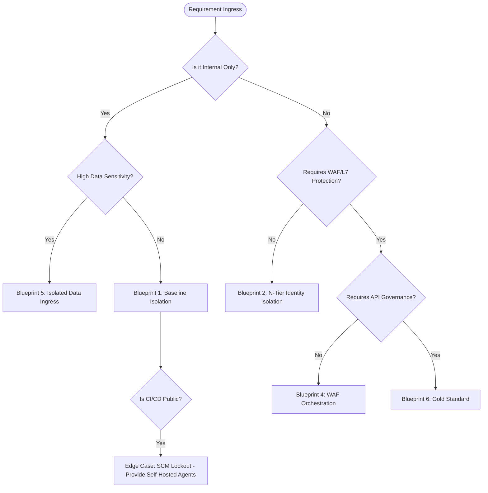

# Azure Zero-Trust Application Framework

This framework provides a structured approach to designing, deploying, and operationalizing secure application perimeters in Azure, based on the "Zero-Trust Trap" architectural principles documented at [portfolio.upendrakumar.com](https://portfolio.upendrakumar.com/blog/2026-02-25-zero-trust-trap-azure-app-services.html).

---

## 1. Core Component Taxonomy

| Component | Responsibility | Trust Vector |
| :--- | :--- | :--- |
| **App Service / Functions** | Compute runtime | **Sovereign** (Execution) |
| **Private Endpoint (PE)** | Inbound network isolation | **Inbound** (Ingress) |
| **VNet Integration** | Outbound tunnel to VNet | **Outbound** (Egress) |
| **App Gateway (WAF)** | Layer 7 inspection / OWASP | **Edge** (Perimeter) |
| **API Management (APIM)** | Governance / Policy / Lifecycle | **Control** (Governance) |
| **Private DNS Zones** | Trust resolution / Handshake | **Discovery** (DNS) |
| **Managed Identity** | Passwordless RBAC authentication | **Identity** (Auth) |

---

## 2. Component Relationship Matrix

The interaction between these components defines the "Sovereignty" of the application perimeter:

1.  **Ingress Trust**: Public -> **AppGW (WAF)** -> [Private VNet] -> **PE** -> **App Service**.
2.  **Governance Layer**: AppGW -> **APIM (Internal)** -> **App Service (PE)**.
3.  **Egress Trust**: **App Service** -> **VNet Integration** -> [Private VNet] -> **PE** -> **Manged Service (SQL/Redis)**.
4.  **Discovery Chain**: All PE interactions rely on **Private DNS Zones** linked to the transport VNet.

---

## 3. The Sovereign Decision Tree

Use this logic to select the appropriate Blueprint for your workload:

---

## 4. Framework Break-down Points (Edge Cases)

Even the most robust architecture has "failure modes." This framework maps the resolution for common architectural collapses:

### A. The SCM / Kudu Lockout (Deployment Failure)
*   **The Breakdown**: Disabling public access on an App Service *also* blocks the SCM (Kudu) portal used by GitHub Actions/Azure DevOps.
*   **The Resolution**: Use **Self-Hosted Agents** inside the VNet or explicitly whitelist **Service Tags** (with caution regarding the shared tenant security model).

### B. The APIM Outbound Paradox
*   **The Breakdown**: Attempting to use a Private Endpoint *on* APIM to talk to a Private Endpoint *on* an App Service fails.
*   **The Resolution**: APIM requires **VNet Integration (Injection)** in Developer/Premium tiers to natively resolve and route to backend PEs.

### C. The Host Header / SNI Handshake Collapse (502 Error)
*   **The Breakdown**: App Gateway forwards a public host header that the backend App Service doesn't recognize.
*   **The Resolution**: Enable **"Pick Hostname from Backend Target"** in the Gateway's HTTP settings to synchronize the handshake.

### D. The Split-Brain DNS Vacuum
*   **The Breakdown**: Non-Azure clients (on-premises/VPN) cannot resolve `.privatelink` addresses and default to the blocked public IP.
*   **The Resolution**: Deploy an **Azure DNS Private Resolver** with conditional forwarders for on-premises clients.

### E. Early-Stage Mount Failures (Linux Functions)
*   **The Breakdown**: Managed Identity isn't ready when Linux Functions try to mount the content share from a private Storage Account.
*   **The Resolution**: Maintain a **hybrid auth approach**—use Connection Strings for the content share (`WEBSITE_CONTENTAZUREFILECONNECTIONSTRING`) and Managed Identity for application logic.

---

## 5. Summary of Blueprints

| Blueprint | Complexity | Cost | Best For |
| :--- | :--- | :--- | :--- |
| **BP 1: Baseline** | Low | Low | HR Tools, Admin Dashboards |
| **BP 2: N-Tier** | Medium | Low | Public SaaS, E-Commerce |
| **BP 3: Egress** | Medium | Low | Data Exfiltration Prevention |
| **BP 4: WAF** | Medium | High | Regulated Public Portals |
| **BP 5: Data Hub** | Medium | Medium | PHI/PII Databases |
| **BP 6: Gold Standard**| High | High | Sovereign Cloud, Federal Apps |

---

Generated by [Upendra Kumar](https://portfolio.upendrakumar.com/) | Built for Enterprise Azure Security.
