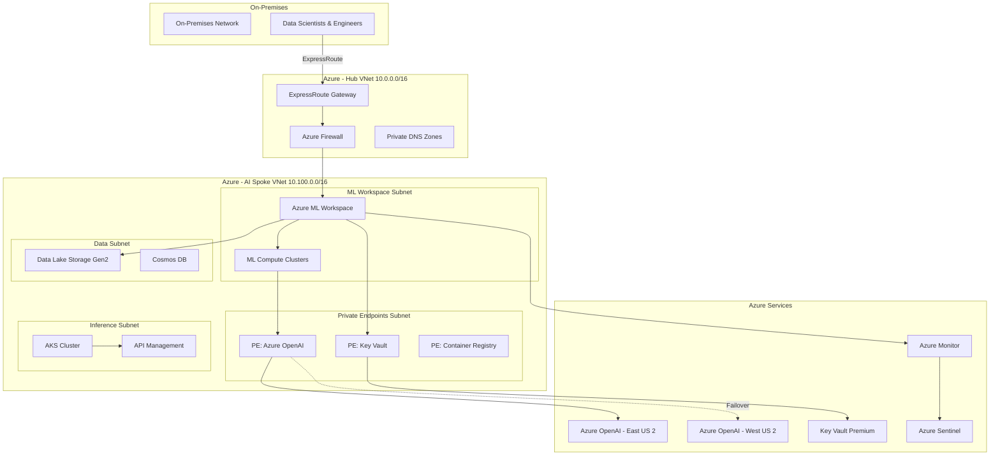
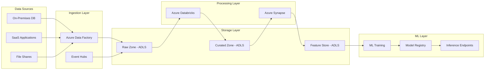
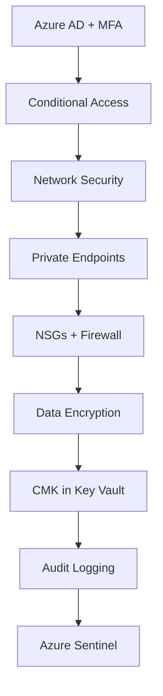
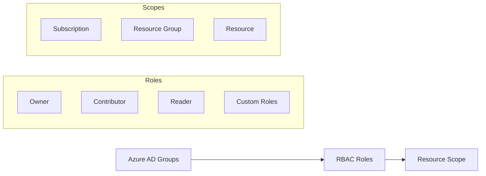
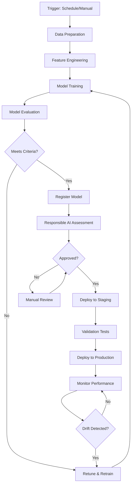
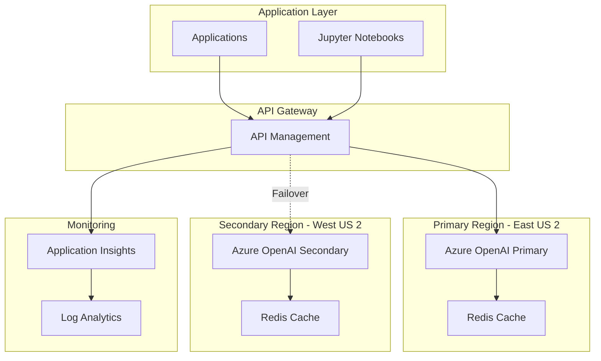

# AI Landing Zone - Detailed Design

**Project**: Azure Landing Zones - Financial Services  
**Component**: AI Landing Zone  
**Version**: 1.0.0  
**Last Updated**: December 2025

---

## 1. Architecture Overview

### 1.1 High-Level Architecture



---

## 2. Network Design

### 2.1 Network Topology

**Hub VNet (10.0.0.0/16)**:
- **Azure Firewall Subnet**: 10.0.1.0/24
- **Gateway Subnet**: 10.0.2.0/24
- **Management Subnet**: 10.0.3.0/24

**AI Spoke VNet (10.100.0.0/16)**:
- **ML Workspace Subnet**: 10.100.1.0/24 (256 IPs)
- **Compute Subnet**: 10.100.2.0/23 (512 IPs for ML clusters)
- **Private Endpoints Subnet**: 10.100.4.0/24 (256 IPs)
- **Data Subnet**: 10.100.5.0/24 (256 IPs)
- **Inference Subnet**: 10.100.6.0/24 (256 IPs for AKS)

### 2.2 Network Security Groups

**ML Workspace NSG**:
| Priority | Direction | Source | Destination | Port | Action |
|----------|-----------|--------|-------------|------|--------|
| 100 | Inbound | 10.0.0.0/16 | 10.100.1.0/24 | 443 | Allow |
| 110 | Inbound | AzureLoadBalancer | * | * | Allow |
| 4096 | Inbound | * | * | * | Deny |
| 100 | Outbound | 10.100.1.0/24 | AzureCloud | 443 | Allow |
| 110 | Outbound | 10.100.1.0/24 | 10.100.0.0/16 | * | Allow |

**Compute Subnet NSG**:
| Priority | Direction | Source | Destination | Port | Action |
|----------|-----------|--------|-------------|------|--------|
| 100 | Inbound | 10.100.1.0/24 | 10.100.2.0/23 | 29876-29877 | Allow |
| 110 | Inbound | BatchNodeManagement | * | 29876-29877 | Allow |
| 4096 | Inbound | * | * | * | Deny |

### 2.3 Private DNS Zones

| Service | Private DNS Zone |
|---------|-----------------|
| Azure ML | privatelink.api.azureml.ms |
| Azure OpenAI | privatelink.openai.azure.com |
| Storage (Blob) | privatelink.blob.core.windows.net |
| Storage (DFS) | privatelink.dfs.core.windows.net |
| Key Vault | privatelink.vaultcore.azure.net |
| Container Registry | privatelink.azurecr.io |
| Cosmos DB | privatelink.documents.azure.com |

---

## 3. Data Architecture

### 3.1 Data Flow Diagram



### 3.2 Data Zones

| Zone | Purpose | Format | Retention | Encryption |
|------|---------|--------|-----------|------------|
| Raw | Ingested data, immutable | Parquet, CSV, JSON | 90 days | CMK |
| Curated | Cleaned, validated data | Delta Lake | 2 years | CMK |
| Feature Store | ML-ready features | Parquet | 1 year | CMK |
| Model Artifacts | Trained models | MLflow | 3 years | CMK |
| Inference Data | Scoring requests/responses | JSON | 30 days | CMK |

---

## 4. Security Architecture

### 4.1 Defense in Depth



### 4.2 Identity and Access Control

**Azure AD Integration**:
- **Authentication**: Azure AD with MFA mandatory
- **Authorization**: RBAC with custom roles
- **Privileged Access**: PIM for admin roles (max 8 hours)
- **Service Principals**: Managed identities for Azure resources

**RBAC Model**:


### 4.3 Data Protection

**Encryption at Rest**:
- **Storage**: AES-256 with customer-managed keys (CMK)
- **Databases**: Transparent Data Encryption (TDE)
- **Disks**: Azure Disk Encryption (ADE)
- **Key Management**: Azure Key Vault Premium (HSM-backed)

**Encryption in Transit**:
- **TLS 1.3**: All HTTPS connections
- **Private Connectivity**: ExpressRoute + Private Endpoints
- **Certificate Management**: Automated rotation via Key Vault

---

## 5. ML Platform Architecture

### 5.1 Azure Machine Learning Workspace

**Configuration**:
- **Workspace Identity**: System-assigned managed identity
- **Network Isolation**: Managed VNet with approved outbound rules
- **Compute**: Private clusters with no public IP
- **Storage**: Private endpoints to ADLS Gen2
- **Container Registry**: Premium tier with geo-replication

### 5.2 Model Training Pipeline



### 5.3 Model Deployment Architecture

**Deployment Options**:
1. **Real-time Inference**: Azure Kubernetes Service (AKS)
   - Autoscaling: 3-10 nodes
   - Load balancer: Azure Load Balancer
   - SSL termination: Application Gateway
   
2. **Batch Inference**: Azure ML Batch Endpoints
   - Scheduled jobs: Daily/weekly
   - Parallel processing: ParallelRunStep
   - Output: ADLS Gen2

3. **Edge Deployment**: Azure IoT Edge (future)

---

## 6. Azure OpenAI Integration

### 6.1 Deployment Architecture



### 6.2 API Management Policies

**Rate Limiting**:
```xml
<rate-limit-by-key calls="1000" renewal-period="60" 
                   counter-key="@(context.Request.IpAddress)" />
```

**Caching**:
```xml
<cache-lookup vary-by-developer="false" vary-by-developer-groups="false">
    <vary-by-query-parameter>prompt</vary-by-query-parameter>
</cache-lookup>
```

**Retry Policy**:
```xml
<retry condition="@(context.Response.StatusCode == 429)" 
       count="3" interval="2" delta="1" />
```

---

## 7. Monitoring and Observability

### 7.1 Monitoring Stack

| Component | Tool | Metrics | Alerts |
|-----------|------|---------|--------|
| Infrastructure | Azure Monitor | CPU, Memory, Disk, Network | Resource health |
| ML Workspace | ML Studio | Training runs, experiments | Job failures |
| Models | Application Insights | Latency, throughput, errors | SLA violations |
| Data | Data Quality | Completeness, accuracy | Data drift |
| Security | Sentinel | Failed logins, anomalies | Security incidents |
| Cost | Cost Management | Daily spend, forecast | Budget thresholds |

### 7.2 Logging Strategy

**Log Categories**:
- **Audit Logs**: All control plane operations → Log Analytics (2 years)
- **Diagnostic Logs**: Resource-specific logs → Log Analytics (90 days)
- **Application Logs**: Custom application logs → Application Insights (30 days)
- **Security Logs**: Security events → Sentinel (1 year)

**Log Retention**:
| Log Type | Hot Retention | Archive Retention |
|----------|---------------|-------------------|
| Audit | 90 days | 7 years |
| Diagnostic | 30 days | 1 year |
| Application | 30 days | 90 days |
| Security | 180 days | 2 years |

---

## 8. Disaster Recovery

### 8.1 DR Strategy

**RPO/RTO Targets**:
| Component | RPO | RTO | Strategy |
|-----------|-----|-----|----------|
| ML Workspace | 4 hours | 4 hours | Geo-redundant config |
| Training Data | 1 hour | 2 hours | GRS replication |
| Models | 24 hours | 4 hours | Model registry sync |
| Inference Endpoints | 1 hour | 2 hours | Multi-region deployment |

### 8.2 Backup Strategy

**Backup Schedule**:
- **ML Workspace Config**: Daily (automated)
- **Training Data**: Continuous replication (GRS)
- **Models**: On registration (automated)
- **Code Repositories**: Git (continuous)
- **Infrastructure as Code**: Git (continuous)

---

## 9. Compliance and Governance

### 9.1 Azure Policy Assignments

| Policy | Effect | Scope |
|--------|--------|-------|
| Require encryption at rest | Deny | Subscription |
| Require private endpoints | Audit | Resource Group |
| Allowed VM SKUs | Deny | Resource Group |
| Require tags | Deny | Resource Group |
| Geo-replication required | Audit | Storage Accounts |

### 9.2 Compliance Controls

**PCI-DSS Requirements**:
- Network segmentation ✓
- Encryption at rest and in transit ✓
- Access control and MFA ✓
- Logging and monitoring ✓
- Regular security assessments ✓

**SOC 2 Controls**:
- Security: Azure Security Center, Sentinel
- Availability: Multi-region, DR testing
- Confidentiality: Encryption, access controls
- Privacy: Data classification, DLP
- Processing Integrity: Model validation, testing

---

## 10. Integration Points

### 10.1 External Systems

| System | Protocol | Authentication | Data Flow |
|--------|----------|---------------|-----------|
| On-Premises DB | ExpressRoute | Service Principal | Inbound |
| CRM (Salesforce) | HTTPS/REST | OAuth 2.0 | Bidirectional |
| Data Warehouse | Private Endpoint | Managed Identity | Inbound |
| DevOps (Azure DevOps) | HTTPS/REST | PAT/Service Principal | Bidirectional |

### 10.2 API Endpoints

**ML Inference API**:
```
POST https://ml-inference.contoso.com/api/v1/score
Authorization: Bearer <token>
Content-Type: application/json

{
  "data": [...],
  "model_version": "1.2.0"
}
```

**Azure OpenAI API**:
```
POST https://aoai.contoso.com/openai/deployments/gpt-4/chat/completions
api-key: <key>
Content-Type: application/json

{
  "messages": [...],
  "temperature": 0.7
}
```

---

## References

- [Azure ML Architecture](https://learn.microsoft.com/azure/machine-learning/concept-azure-machine-learning-architecture)
- [Azure OpenAI Architecture](https://learn.microsoft.com/azure/ai-services/openai/concepts/architecture)
- [Azure Security Baseline](https://learn.microsoft.com/security/benchmark/azure/)

---

**Document Owner**: Cloud Architect  
**Reviewers**: Security Architect, Network Architect, ML Engineer  
**Approval Date**: December 2025  
**Next Review**: March 2026
