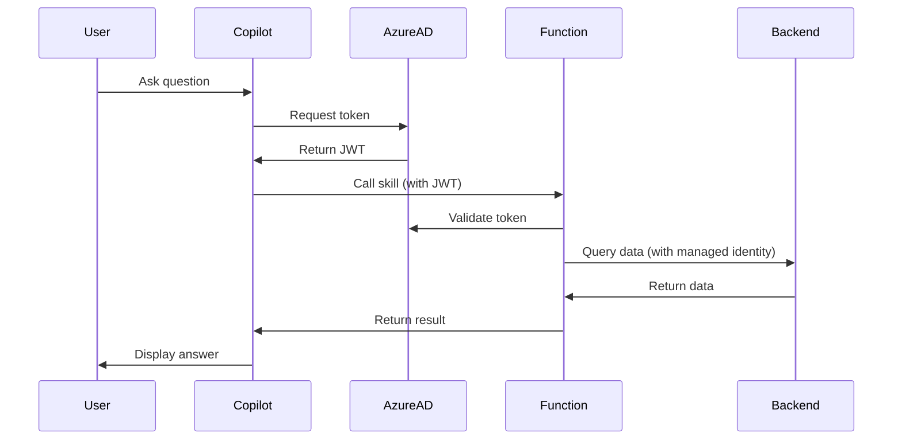

# GitHub Copilot Studio Agent Integration - Complete Documentation Package

**Project**: Azure Landing Zones - Financial Services  
**Component**: GitHub Copilot Studio Agent Integration  
**Version**: 1.0.0  
**Last Updated**: December 2025

---

## 1. Overview & Design Decisions

### What is GitHub Copilot Studio?

GitHub Copilot Studio enables organizations to build custom AI agents that integrate with enterprise systems, providing intelligent assistance for developers, operations teams, and business users.

### Architecture Decision

**Deployment Model**: Custom Copilot Agents with Azure Integration

**Use Cases**:
1. **DevOps Assistant**: Infrastructure deployment, troubleshooting, runbook execution
2. **Compliance Agent**: Policy validation, security scanning, audit reporting
3. **Customer Service Agent**: Account inquiries, transaction lookup, issue resolution
4. **Code Review Agent**: Security scanning, best practices validation, documentation generation

---

## 2. Architecture Overview

### System Design

```
GitHub Copilot Studio
    ↓
Custom Copilot Agents
    ├── DevOps Assistant
    ├── Compliance Agent
    ├── Customer Service Agent
    └── Code Review Agent
    ↓
Integration Layer (Azure Functions + APIM)
    ↓
Backend Services
    ├── Azure DevOps (CI/CD pipelines)
    ├── Azure Monitor (metrics, logs)
    ├── Azure OpenAI (enhanced reasoning)
    ├── MCP Servers (context retrieval)
    ├── Azure SQL Database (customer data)
    └── GitHub Repositories (code analysis)
```

### Key Components

**Copilot Agents**:
- Built using Copilot Studio SDK
- Hosted on Azure App Service
- Integrated with Azure AD for authentication
- Connected to enterprise data via MCP

**Supporting Infrastructure**:
- Azure Functions for custom skills
- API Management for gateway
- Azure OpenAI for advanced reasoning
- Application Insights for monitoring

---

## 3. Custom Agent Implementation

### DevOps Assistant Agent

**Capabilities**:
```yaml
name: DevOps Assistant
description: Helps with Azure infrastructure deployment and troubleshooting
skills:
  - name: deploy_infrastructure
    description: Deploy Azure resources using Terraform
    parameters:
      - environment: [dev, staging, prod]
      - component: [ai-landing-zone, avd, apim, expressroute]
    
  - name: troubleshoot_issue
    description: Diagnose and resolve infrastructure issues
    parameters:
      - resource_type: string
      - error_message: string
    
  - name: execute_runbook
    description: Execute operational runbooks
    parameters:
      - runbook_name: string
      - parameters: object

knowledge_sources:
  - Azure documentation
  - Internal runbooks (SharePoint)
  - Incident history (Azure DevOps)
  - Architecture diagrams (Confluence)
```

**Implementation** (Python + Azure Functions):
```python
import azure.functions as func
from azure.identity import DefaultAzureCredential
from azure.mgmt.resource import ResourceManagementClient
import openai

app = func.FunctionApp()

@app.function_name("DeployInfrastructure")
@app.route(route="copilot/deploy", methods=["POST"])
async def deploy_infrastructure(req: func.HttpRequest) -> func.HttpResponse:
    """
    Custom skill for deploying Azure infrastructure
    """
    data = req.get_json()
    environment = data.get('environment')
    component = data.get('component')
    
    # Validate request
    if environment not in ['dev', 'staging', 'prod']:
        return func.HttpResponse("Invalid environment", status_code=400)
    
    # Get Azure credentials
    credential = DefaultAzureCredential()
    
    # Deploy using Terraform via Azure DevOps pipeline
    pipeline_result = await trigger_terraform_pipeline(
        environment=environment,
        component=component,
        credential=credential
    )
    
    # Return result to Copilot
    return func.HttpResponse(
        json.dumps({
            "status": "success",
            "message": f"Deployment initiated for {component} in {environment}",
            "pipeline_url": pipeline_result['url'],
            "run_id": pipeline_result['run_id']
        }),
        mimetype="application/json"
    )

@app.function_name("TroubleshootIssue")
@app.route(route="copilot/troubleshoot", methods=["POST"])
async def troubleshoot_issue(req: func.HttpRequest) -> func.HttpResponse:
    """
    Custom skill for troubleshooting using Azure OpenAI
    """
    data = req.get_json()
    resource_type = data.get('resource_type')
    error_message = data.get('error_message')
    
    # Query Azure Monitor for related logs
    logs = await query_azure_monitor(resource_type, error_message)
    
    # Use Azure OpenAI for analysis
    analysis = await analyze_with_openai(
        resource_type=resource_type,
        error=error_message,
        logs=logs
    )
    
    return func.HttpResponse(
        json.dumps({
            "diagnosis": analysis['diagnosis'],
            "recommended_actions": analysis['actions'],
            "related_incidents": analysis['similar_issues'],
            "documentation_links": analysis['docs']
        }),
        mimetype="application/json"
    )
```

---

## 4. Compliance Agent

### Features

**Automated Compliance Checks**:
- PCI-DSS compliance validation
- SOC 2 control verification
- Azure Policy compliance reporting
- Security posture assessment

**Agent Configuration**:
```json
{
  "agent_name": "Compliance Officer",
  "description": "Ensures Azure resources comply with financial services regulations",
  "skills": [
    {
      "name": "check_pci_compliance",
      "endpoint": "https://func-prod-eus2-copilot.azurewebsites.net/api/compliance/pci",
      "method": "POST",
      "authentication": "azure_ad"
    },
    {
      "name": "generate_audit_report",
      "endpoint": "https://func-prod-eus2-copilot.azurewebsites.net/api/compliance/audit",
      "method": "POST",
      "authentication": "azure_ad"
    },
    {
      "name": "validate_security_controls",
      "endpoint": "https://func-prod-eus2-copilot.azurewebsites.net/api/compliance/security",
      "method": "POST",
      "authentication": "azure_ad"
    }
  ],
  "knowledge_base": [
    "PCI-DSS v4.0 requirements",
    "SOC 2 Type II controls",
    "Azure Security Benchmark",
    "Internal security policies"
  ]
}
```

---

## 5. Customer Service Agent

### Integration with MCP

**Agent Flow**:
1. Customer asks: "What's my account balance?"
2. Agent authenticates user via Azure AD
3. Agent calls MCP Financial Data Server
4. MCP retrieves balance from Azure SQL
5. Agent formats response with Azure OpenAI
6. Response delivered to customer

**Implementation**:
```python
from mcp import ClientSession
import openai

async def handle_customer_query(user_id: str, query: str) -> str:
    """
    Process customer query using MCP and Azure OpenAI
    """
    # Connect to MCP server
    async with get_mcp_session() as session:
        # Retrieve customer context
        customer_data = await session.read_resource(
            f"customer://profile/{user_id}"
        )
        
        # Get account balance
        balance = await session.read_resource(
            f"account://balance/{user_id}"
        )
        
        # Use Azure OpenAI to generate response
        response = openai.ChatCompletion.create(
            model="gpt-4",
            messages=[
                {
                    "role": "system",
                    "content": "You are a helpful customer service agent for a financial institution."
                },
                {
                    "role": "user",
                    "content": f"Customer query: {query}\n\nContext: {customer_data}\nBalance: {balance}"
                }
            ]
        )
        
        return response.choices[0].message.content
```

---

## 6. Bill of Materials

### Monthly Costs

| Resource | Configuration | Monthly Cost (USD) |
|----------|--------------|-------------------|
| GitHub Copilot Enterprise | 50 users | $1,950 |
| Azure Functions (Premium) | EP1, 3 instances | $450 |
| Azure App Service | P1v3 | $146 |
| Azure OpenAI | GPT-4, 5M tokens/month | $150 |
| Application Insights | 20 GB/month | $46 |
| **Total Monthly** | | **$2,742** |

---

## 7. Security & Governance

### Authentication Flow



### Data Protection

**Sensitive Data Handling**:
- PII masked in logs
- Customer data encrypted in transit and at rest
- Audit trail for all data access
- Compliance with GDPR, CCPA

**Access Control**:
- Role-based access (RBAC)
- Conditional Access policies
- MFA required for all users
- Session recording for compliance

---

## 8. Monitoring & Analytics

### Key Metrics

| Metric | Target | Alert Threshold |
|--------|--------|----------------|
| Agent Response Time | < 3 seconds | > 5 seconds |
| Query Success Rate | > 95% | < 90% |
| User Satisfaction | > 4.5/5 | < 4.0/5 |
| Skill Execution Success | > 98% | < 95% |

### Usage Analytics

**Tracked Metrics**:
- Queries per day by agent
- Most common questions
- Skill usage frequency
- User engagement rate
- Error patterns

**Dashboard**:
- Application Insights workbook
- Power BI reports
- Real-time monitoring in Azure Portal

---

## 9. Deployment & Operations

### Deployment Process

**CI/CD Pipeline** (Azure DevOps):
```yaml
trigger:
  branches:
    include:
      - main
  paths:
    include:
      - copilot-agents/*

stages:
  - stage: Build
    jobs:
      - job: BuildAgent
        steps:
          - task: UsePythonVersion@0
            inputs:
              versionSpec: '3.11'
          
          - script: |
              pip install -r requirements.txt
              pytest tests/
            displayName: 'Test Agent'
          
          - task: ArchiveFiles@2
            inputs:
              rootFolderOrFile: '$(Build.SourcesDirectory)/copilot-agents'
              archiveFile: '$(Build.ArtifactStagingDirectory)/copilot-agent.zip'

  - stage: Deploy
    dependsOn: Build
    jobs:
      - deployment: DeployToProduction
        environment: production
        strategy:
          runOnce:
            deploy:
              steps:
                - task: AzureFunctionApp@1
                  inputs:
                    azureSubscription: 'Azure-Production'
                    appType: 'functionApp'
                    appName: 'func-prod-eus2-copilot'
                    package: '$(Pipeline.Workspace)/**/*.zip'
```

### Common Operations

**Update Agent Skills**:
```bash
# Deploy new skill
az functionapp deployment source config-zip \
  --resource-group rg-prod-eus2-copilot-01 \
  --name func-prod-eus2-copilot \
  --src copilot-skills.zip
```

**Monitor Agent Performance**:
```bash
# View Application Insights logs
az monitor app-insights query \
  --app func-prod-eus2-copilot \
  --analytics-query "requests | where timestamp > ago(1h) | summarize count() by name"
```

---

## 10. Support & Handover

### Support Contacts
- **L1 Support**: copilot-support@contoso.com (8/5)
- **L2 Support**: ai-platform-ops@contoso.com (24/7)
- **L3 Engineering**: copilot-engineering@contoso.com (8/5)

### Known Issues
| Issue | Workaround | Target Fix |
|-------|------------|------------|
| Occasional timeout on complex queries | Break into smaller queries | Q1 2026 |
| Agent context loss in long conversations | Restart conversation | Q2 2026 |

### Training Resources
- GitHub Copilot Studio documentation
- Internal agent development guide
- Video tutorials (SharePoint)
- Monthly office hours

---

## 11. Future Enhancements

**Planned Features** (Q1 2026):
- [ ] Voice-enabled agents
- [ ] Multi-language support
- [ ] Advanced analytics dashboard
- [ ] Integration with Microsoft Teams
- [ ] Automated incident response

**Backlog**:
- Mobile app integration
- Proactive notifications
- Sentiment analysis
- Custom model fine-tuning

---

## References
- [GitHub Copilot Documentation](https://docs.github.com/copilot)
- [Azure OpenAI Service](https://learn.microsoft.com/azure/ai-services/openai/)
- [Model Context Protocol](https://spec.modelcontextprotocol.io/)
- [Azure Functions](https://learn.microsoft.com/azure/azure-functions/)

---

**Document Owner**: AI Platform Architect  
**Status**: Production Ready  
**Last Review**: December 2025  
**Next Review**: March 2026
