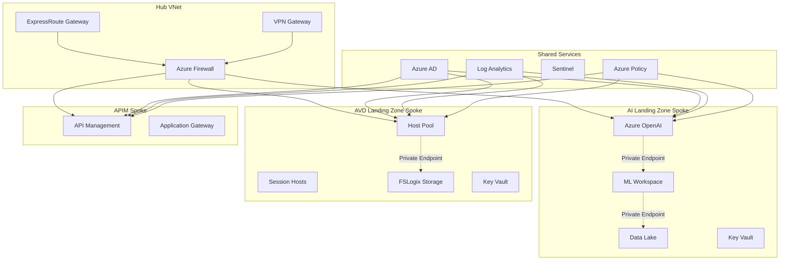
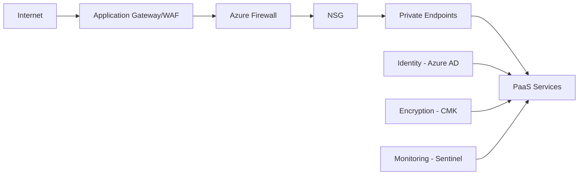
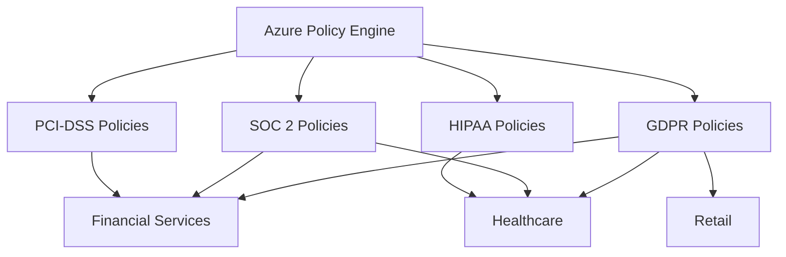
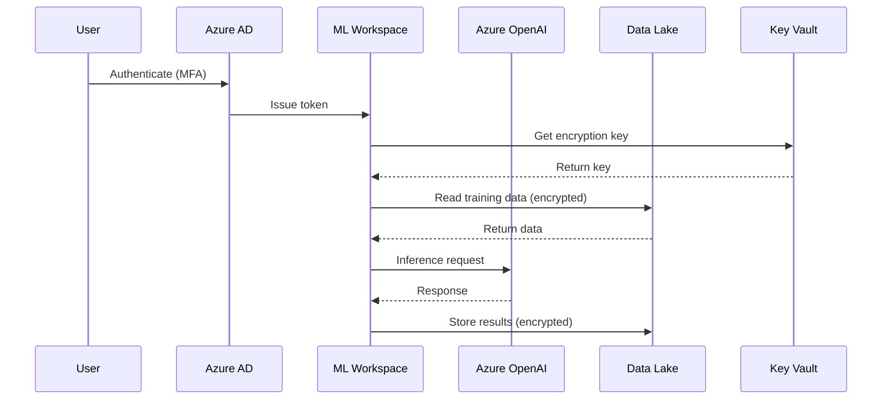
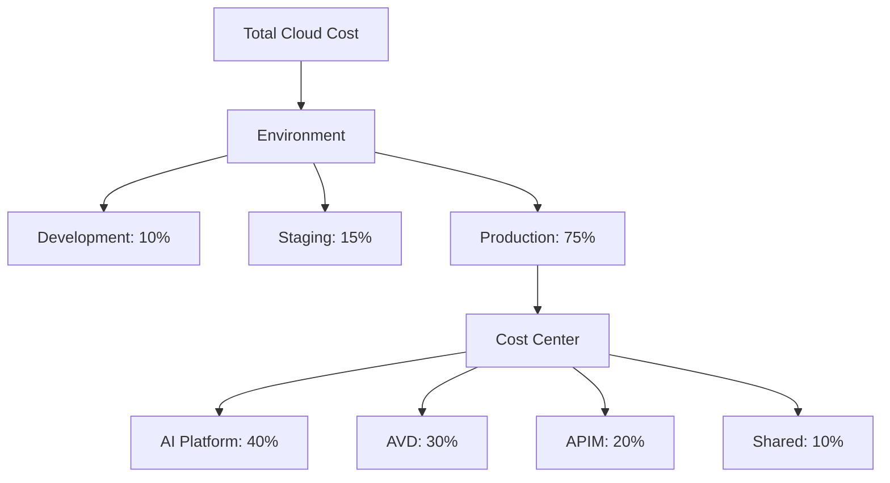

# Azure Landing Zones Architecture

High-level architecture overview for the Azure Landing Zones project.

## Architecture Principles

1. **Security First**: Defense-in-depth with zero-trust principles
2. **Compliance by Design**: Built-in compliance controls
3. **Cost Optimization**: FinOps practices integrated
4. **Scalability**: Designed for enterprise scale
5. **Modularity**: Reusable components across industries

## High-Level Architecture



## Network Architecture

### Hub-and-Spoke Topology

**Hub VNet** (10.0.0.0/16):
- Azure Firewall subnet
- Gateway subnet (VPN/ExpressRoute)
- Bastion subnet
- Shared services

**Spoke VNets**:
- AI Landing Zone: 10.100.0.0/16
- AVD Landing Zone: 10.200.0.0/16
- APIM: 10.300.0.0/16

### Connectivity

- **On-premises**: ExpressRoute (primary) + VPN (backup)
- **Inter-spoke**: Via Azure Firewall
- **Internet**: Outbound via Azure Firewall
- **PaaS Services**: Private endpoints only

## Security Architecture

### Defense in Depth



### Security Layers

1. **Network Security**
   - Azure Firewall for traffic inspection
   - NSGs for subnet-level filtering
   - Private endpoints (no public access)
   - DDoS Protection Standard

2. **Identity & Access**
   - Azure AD with MFA
   - Conditional Access policies
   - Privileged Identity Management (PIM)
   - RBAC with least privilege

3. **Data Protection**
   - Customer-managed keys (CMK)
   - TLS 1.3 for data in transit
   - Encryption at rest (AES-256)
   - Immutable storage for compliance

4. **Monitoring & Response**
   - Azure Sentinel for SIEM
   - Log Analytics for centralized logging
   - Azure Monitor for metrics
   - Automated incident response

## Compliance Architecture

### Multi-Framework Support



### Compliance Controls

| Framework | Key Controls | Implementation |
|-----------|-------------|----------------|
| PCI-DSS | Network segmentation, CMK, audit logs | Azure Policy + NSGs |
| HIPAA | PHI encryption, 7-year retention, BAA | Premium Key Vault + LAW |
| SOC 2 | Access controls, monitoring, DR | Azure AD + Sentinel |
| GDPR | Data residency, right to erasure | Region selection + policies |

## Data Flow Architecture

### AI Landing Zone Data Flow



## Disaster Recovery Architecture

### Multi-Region Strategy

**Primary Region**: East US 2
**Secondary Region**: West US 2

**RPO**: 4 hours
**RTO**: 8 hours

### DR Components

- **Data**: Geo-redundant storage (GRS)
- **Compute**: Secondary region deployment ready
- **Network**: Pre-configured ExpressRoute to both regions
- **Failover**: Azure Traffic Manager for automated failover

## Cost Architecture

### Cost Allocation Model



### Cost Optimization

- **Reserved Instances**: 40% savings on consistent workloads
- **Autoscaling**: 30% savings on variable workloads
- **Storage Lifecycle**: 50% savings on cold data
- **Spot Instances**: 90% savings on interruptible workloads

## Integration Patterns

### Pattern 1: AI/ML Pipeline

```
Data Sources → Data Lake → ML Workspace → Azure OpenAI → Application
```

### Pattern 2: Secure Remote Access

```
User → Azure AD → AVD Host Pool → Corporate Resources
```

### Pattern 3: API Gateway

```
External Apps → Application Gateway → APIM → Backend Services
```

## Technology Stack

### Infrastructure
- **IaC**: Terraform >= 1.6.0
- **Version Control**: Git
- **CI/CD**: GitHub Actions

### Azure Services
- **Compute**: Azure ML, AVD, VMs
- **Storage**: Data Lake Gen2, Azure Files
- **Networking**: VNet, Private Endpoints, Firewall
- **Security**: Key Vault, Azure AD, Sentinel
- **Monitoring**: Log Analytics, Application Insights

### Compliance & Governance
- **Policy**: Azure Policy
- **Cost**: Azure Cost Management
- **Security**: Microsoft Defender for Cloud

## Design Decisions

### Why Hub-and-Spoke?
- Centralized security controls
- Simplified connectivity management
- Cost-effective shared services
- Isolation between workloads

### Why Private Endpoints?
- No public IP exposure
- Traffic stays on Microsoft backbone
- Compliance requirement (PCI-DSS, HIPAA)
- Reduced attack surface

### Why Customer-Managed Keys?
- Regulatory requirements
- Enhanced security posture
- Key rotation control
- Audit trail for key access

### Why Multi-Region?
- Business continuity
- Disaster recovery
- Performance optimization
- Compliance (data residency)

## Future Enhancements

1. **Multi-Cloud**: Extend to AWS/GCP
2. **Edge Computing**: Azure Stack Edge integration
3. **AI/ML Ops**: Enhanced MLOps pipelines
4. **Zero Trust**: Implement full zero-trust architecture
5. **Sustainability**: Carbon-aware computing

## References

- [Azure Cloud Adoption Framework](https://learn.microsoft.com/azure/cloud-adoption-framework/)
- [Azure Well-Architected Framework](https://learn.microsoft.com/azure/well-architected/)
- [Azure Landing Zone Accelerator](https://aka.ms/alz)
- [Azure Verified Modules](https://aka.ms/AVM)

---

**Last Updated**: December 2025  
**Version**: 1.0.0
