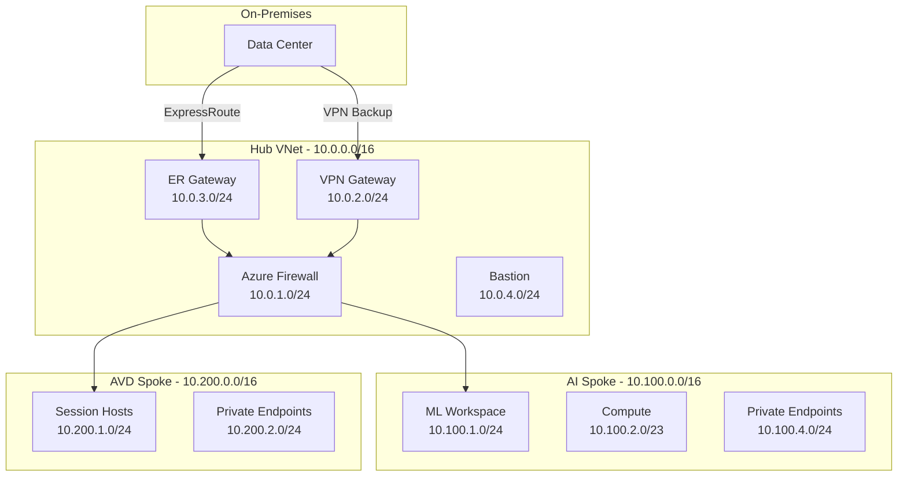
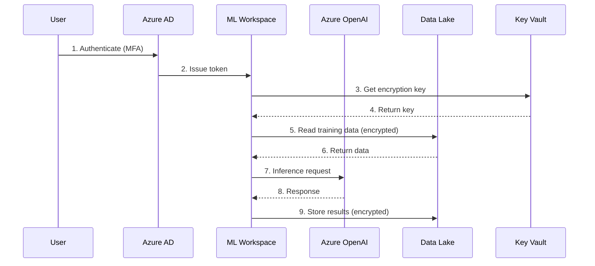
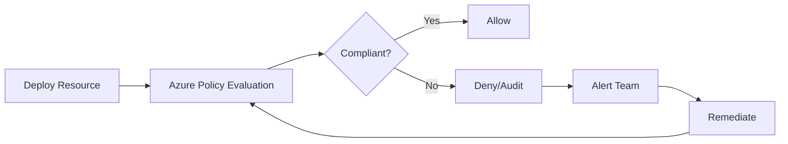

# Azure Landing Zones - Technical Deep Dive
## Architecture & Implementation Details

---

## Slide 1: Title Slide

# Technical Deep Dive
## Azure Landing Zones Architecture

**For Technical Stakeholders**

Date: December 2025  
Audience: Architects, Engineers, DevOps Teams

---

## Slide 2: Agenda

### Session Overview

1. **Architecture Patterns** (15 min)
   - Hub-and-spoke topology
   - Network design
   - Security architecture

2. **Infrastructure as Code** (20 min)
   - Terraform modules
   - CI/CD pipelines
   - Testing framework

3. **Security & Compliance** (15 min)
   - Defense-in-depth
   - Policy-as-code
   - Compliance automation

4. **Operations & Monitoring** (10 min)
   - Observability
   - Incident response
   - DR procedures

5. **Q&A** (10 min)

---

## Slide 3: Architecture Overview

### Hub-and-Spoke Topology



**Key Design Principles**:
- Centralized security (Azure Firewall)
- Isolated workloads (separate spokes)
- Redundant connectivity (ER + VPN)
- Zero trust network access

---

## Slide 4: Network Architecture

### IP Address Allocation

| Network | CIDR | Purpose | Hosts |
|---------|------|---------|-------|
| Hub VNet | 10.0.0.0/16 | Shared services | 65,536 |
| AI Spoke | 10.100.0.0/16 | AI/ML workloads | 65,536 |
| AVD Spoke | 10.200.0.0/16 | Virtual desktops | 65,536 |
| APIM Spoke | 10.300.0.0/16 | API gateway | 65,536 |

### Subnet Design (AI Spoke Example)

```
10.100.0.0/16 - AI Landing Zone
├── 10.100.1.0/24   - ML Workspace (254 hosts)
├── 10.100.2.0/23   - Compute Cluster (510 hosts)
├── 10.100.4.0/24   - Private Endpoints (254 hosts)
└── 10.100.5.0/24   - Data Services (254 hosts)
```

### Routing

- **Default route**: 0.0.0.0/0 → Azure Firewall
- **On-prem routes**: Via ExpressRoute/VPN
- **Inter-spoke**: Via Azure Firewall (no direct peering)

---

## Slide 5: Security Architecture

### Defense-in-Depth Layers

```
Layer 7: Application Security
  ├── Azure AD Authentication
  ├── RBAC Authorization
  └── Application-level encryption

Layer 6: Data Security
  ├── Customer-Managed Keys (CMK)
  ├── TLS 1.3 in transit
  └── Encryption at rest (AES-256)

Layer 5: Identity & Access
  ├── Multi-Factor Authentication
  ├── Conditional Access
  └── Privileged Identity Management

Layer 4: Network Security
  ├── Azure Firewall (L7 inspection)
  ├── Network Security Groups (L4)
  └── Private Endpoints (no public access)

Layer 3: Perimeter Security
  ├── DDoS Protection Standard
  ├── Application Gateway + WAF
  └── ExpressRoute (private connectivity)

Layer 2: Monitoring & Response
  ├── Azure Sentinel (SIEM)
  ├── Microsoft Defender for Cloud
  └── Log Analytics

Layer 1: Physical Security
  └── Azure datacenter security
```

---

## Slide 6: Infrastructure as Code

### Terraform Module Structure

```
terraform/
├── modules/
│   ├── ai-landing-zone/
│   │   ├── main.tf           # 400+ lines
│   │   ├── variables.tf      # 200+ lines
│   │   ├── outputs.tf        # 150+ lines
│   │   ├── versions.tf
│   │   └── README.md
│   └── avd-landing-zone/
│       ├── main.tf           # 300+ lines
│       ├── variables.tf
│       ├── outputs.tf
│       ├── versions.tf
│       └── README.md
├── environments/
│   ├── dev/
│   ├── staging/
│   └── prod/
└── patterns/
    ├── financial-services/
    └── healthcare/
```

### Module Example

```hcl
module "ai_landing_zone" {
  source = "../../modules/ai-landing-zone"

  resource_group_name = "rg-prod-eus2-ai-01"
  location            = "eastus2"
  environment         = "prod"
  vnet_address_space  = ["10.100.0.0/16"]
  
  industry_compliance = {
    pci_dss = true
    hipaa   = false
    sox     = false
    gdpr    = true
  }
  
  cost_tier = "standard"
}
```

---

## Slide 7: CI/CD Pipeline

### GitHub Actions Workflow

```yaml
name: Terraform Deploy

on:
  pull_request:
    branches: [main]
  push:
    branches: [main]

jobs:
  validate:
    - terraform fmt -check
    - terraform validate
  
  security-scan:
    - checkov (100+ checks)
    - tfsec (Terraform security)
    - trivy (vulnerabilities)
  
  cost-estimate:
    - infracost breakdown
    - Post PR comment
  
  plan:
    - terraform plan
    - Upload artifact
  
  apply:
    - terraform apply (on merge)
    - Notify team
```

### Pipeline Benefits

- ✅ **Automated validation**: Catch errors before deployment
- ✅ **Security scanning**: 100% coverage
- ✅ **Cost visibility**: Know costs before deploying
- ✅ **Audit trail**: All changes tracked in Git

---

## Slide 8: Testing Framework

### Terratest Suite

```go
func TestAILandingZone(t *testing.T) {
    terraformOptions := &terraform.Options{
        TerraformDir: "../../../terraform/modules/ai-landing-zone",
        Vars: map[string]interface{}{
            "resource_group_name": "rg-test-eus2-ai-01",
            "location":            "eastus2",
            "environment":         "dev",
            "vnet_address_space":  []string{"10.100.0.0/16"},
        },
    }

    defer terraform.Destroy(t, terraformOptions)
    terraform.InitAndApply(t, terraformOptions)

    // Validate outputs
    mlWorkspaceId := terraform.Output(t, terraformOptions, "ml_workspace_id")
    assert.NotEmpty(t, mlWorkspaceId)
}
```

### Test Coverage

| Test Case | Purpose | Duration |
|-----------|---------|----------|
| Basic Deployment | Validate core resources | 15 min |
| Compliance | Verify security controls | 10 min |
| Network Security | Test NSG rules, private endpoints | 12 min |
| Cost Tiers | Validate different SKUs | 20 min |
| Monitoring | Check diagnostic settings | 8 min |

**Total**: 6 test cases, ~65 minutes

---

## Slide 9: Azure Policy as Code

### Policy Definition Example

```json
{
  "properties": {
    "displayName": "Require CMK for Storage",
    "policyType": "Custom",
    "mode": "All",
    "description": "Enforces customer-managed keys",
    "policyRule": {
      "if": {
        "allOf": [
          {
            "field": "type",
            "equals": "Microsoft.Storage/storageAccounts"
          },
          {
            "field": "Microsoft.Storage/storageAccounts/encryption.keySource",
            "notEquals": "Microsoft.Keyvault"
          }
        ]
      },
      "then": {
        "effect": "deny"
      }
    }
  }
}
```

### Policy Initiative (Financial Services)

- ✅ Require CMK for storage
- ✅ Require private endpoints
- ✅ Require TLS 1.3 minimum
- ✅ Deny public network access
- ✅ Require diagnostic settings

---

## Slide 10: Data Flow Architecture

### AI/ML Pipeline



### Data Protection

- **At Rest**: AES-256 with CMK
- **In Transit**: TLS 1.3
- **In Use**: Confidential computing (optional)

---

## Slide 11: Monitoring & Observability

### Monitoring Stack

```
┌─────────────────────────────────────┐
│      Azure Monitor (Metrics)        │
├─────────────────────────────────────┤
│   Log Analytics (Logs & Queries)    │
├─────────────────────────────────────┤
│  Application Insights (APM)         │
├─────────────────────────────────────┤
│   Azure Sentinel (SIEM)             │
├─────────────────────────────────────┤
│   Workbooks (Dashboards)            │
└─────────────────────────────────────┘
```

### Key Metrics

**Infrastructure**:
- CPU/Memory utilization
- Network throughput
- Storage IOPS
- Availability (99.9% SLA)

**Application**:
- Request latency (P95 < 200ms)
- Error rate (< 0.1%)
- Throughput (requests/sec)
- Dependency health

**Security**:
- Failed login attempts
- Policy violations
- Threat detections
- Compliance score

---

## Slide 12: Disaster Recovery

### Multi-Region Strategy

**Primary Region**: East US 2  
**Secondary Region**: West US 2

### Recovery Objectives

| Component | RPO | RTO | Strategy |
|-----------|-----|-----|----------|
| Data Lake | 4 hours | 8 hours | GRS replication |
| ML Models | 24 hours | 4 hours | Model registry backup |
| AVD Profiles | 1 hour | 2 hours | FSLogix replication |
| Configuration | 0 (IaC) | 1 hour | Terraform redeploy |

### Failover Process

1. **Detection**: Automated health checks
2. **Decision**: Runbook execution
3. **Failover**: Traffic Manager redirect
4. **Validation**: Smoke tests
5. **Communication**: Stakeholder notification

---

## Slide 13: Performance Optimization

### Compute Optimization

**ML Compute Clusters**:
```hcl
scale_settings {
  min_node_count = 0    # Scale to zero
  max_node_count = 50
  scale_down_nodes_after_idle_duration = "PT5M"
}
```

**Benefits**:
- Pay only for active compute
- Automatic scaling based on workload
- $16,800/year savings

### Storage Optimization

**Lifecycle Management**:
```hcl
rule {
  name = "MoveRawToCool"
  actions {
    tier_to_cool_after_days    = 30
    tier_to_archive_after_days = 90
    delete_after_days          = 365
  }
}
```

**Savings**: $7,200/year

---

## Slide 14: Security Controls

### Network Security

**Azure Firewall Rules**:
```
Priority 100: Allow Hub → Spoke (HTTPS)
Priority 200: Allow Spoke → Azure Services
Priority 300: Allow Spoke → Internet (via proxy)
Priority 9999: Deny All
```

**NSG Rules (ML Subnet)**:
```
Priority 100: Allow Hub VNet → 443 (Inbound)
Priority 110: Allow AzureLoadBalancer (Inbound)
Priority 4096: Deny All (Inbound)
```

### Identity Security

**Conditional Access Policies**:
- ✅ Require MFA for all users
- ✅ Block legacy authentication
- ✅ Require compliant devices
- ✅ Require approved apps
- ✅ Block high-risk sign-ins

---

## Slide 15: Compliance Automation

### Continuous Compliance



### Compliance Dashboard

| Control | Status | Last Check | Remediation |
|---------|--------|------------|-------------|
| CMK Encryption | ✅ Pass | 5 min ago | N/A |
| Private Endpoints | ✅ Pass | 5 min ago | N/A |
| TLS 1.3 | ⚠️ Warning | 10 min ago | 2 resources |
| MFA Enabled | ✅ Pass | 1 hour ago | N/A |
| Audit Logging | ✅ Pass | 5 min ago | N/A |

---

## Slide 16: Operational Procedures

### Day 1 Operations

**Deployment**:
1. Review Terraform plan
2. Execute deployment
3. Validate resources
4. Configure monitoring
5. Update documentation

**Monitoring**:
- 24/7 automated monitoring
- Alert escalation (L1 → L2 → L3)
- Incident response playbooks

### Day 2 Operations

**Maintenance**:
- Weekly: Security patches
- Monthly: Cost optimization review
- Quarterly: DR testing
- Annually: Architecture review

**Change Management**:
- All changes via Git PR
- Peer review required
- Automated testing
- Rollback capability

---

## Slide 17: Troubleshooting Guide

### Common Issues

**Issue**: Terraform deployment fails  
**Cause**: Insufficient permissions  
**Solution**: Verify service principal has Contributor role

**Issue**: Private endpoint connection fails  
**Cause**: NSG blocking traffic  
**Solution**: Review NSG rules, allow traffic from source subnet

**Issue**: High costs  
**Cause**: Resources not scaling down  
**Solution**: Review autoscaling configuration

**Issue**: Compliance policy violation  
**Cause**: Manual resource creation  
**Solution**: Use Terraform for all deployments

### Support Escalation

- **L1**: Monitoring team (24/7)
- **L2**: Cloud operations (business hours)
- **L3**: Architecture team (on-call)
- **L4**: Microsoft support (as needed)

---

## Slide 18: Performance Benchmarks

### AI Landing Zone

| Metric | Target | Actual | Status |
|--------|--------|--------|--------|
| ML Training (100GB) | < 2 hours | 1.5 hours | ✅ |
| Inference Latency (P95) | < 200ms | 150ms | ✅ |
| Data Lake Read (1GB) | < 30s | 25s | ✅ |
| Model Deployment | < 5 min | 4 min | ✅ |

### AVD Landing Zone

| Metric | Target | Actual | Status |
|--------|--------|--------|--------|
| Login Time | < 30s | 25s | ✅ |
| Session Latency | < 100ms | 80ms | ✅ |
| Concurrent Users | 1000 | 1200 | ✅ |
| Profile Load Time | < 10s | 8s | ✅ |

---

## Slide 19: Technical Roadmap

### Q1 2026

- ✅ Phase 1 & 2 Complete
- 🔄 Production deployment
- 📋 Additional modules (APIM, ExpressRoute)

### Q2 2026

- Multi-region deployment
- Enhanced monitoring dashboards
- Automated DR testing

### Q3 2026

- AI/ML Ops pipeline
- Advanced cost optimization
- Zero-trust implementation

### Q4 2026

- Multi-cloud expansion
- Edge computing integration
- Sustainability metrics

---

## Slide 20: Q&A

### Technical Questions?

**Topics Covered**:
- Architecture patterns
- Infrastructure as Code
- Security & compliance
- Operations & monitoring

**Additional Resources**:
- GitHub Repository
- Architecture documentation
- Runbooks
- API documentation

---

*Technical Deep Dive - For Internal Use*  
*© 2025 Azure Landing Zones Project*
