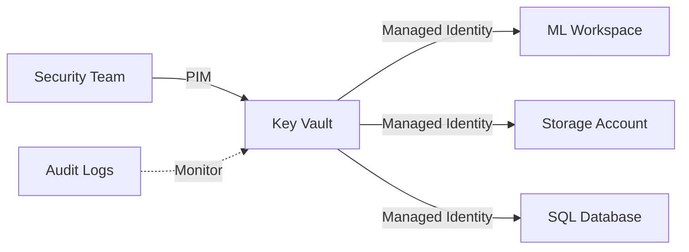

# Azure Landing Zones - Security & Compliance
## Enterprise Security Framework

---

## Slide 1: Title Slide

# Security & Compliance
## Azure Landing Zones

**Protecting Your Cloud Infrastructure**

Date: December 2025  
Audience: CISO, Security Team, Compliance Officers

---

## Slide 2: Security Overview

### Zero Trust Security Model

**Principles**:
1. **Verify explicitly**: Always authenticate and authorize
2. **Least privilege access**: Just-in-time and just-enough-access
3. **Assume breach**: Minimize blast radius and segment access

### Our Implementation

```
┌─────────────────────────────────────┐
│     Identity & Access (Azure AD)    │
├─────────────────────────────────────┤
│   Network Security (Firewall/NSG)   │
├─────────────────────────────────────┤
│  Data Protection (Encryption/CMK)   │
├─────────────────────────────────────┤
│   Monitoring (Sentinel/Defender)    │
└─────────────────────────────────────┘
```

---

## Slide 3: Threat Landscape

### Financial Services Threats

| Threat | Frequency | Impact | Our Mitigation |
|--------|-----------|--------|----------------|
| **Ransomware** | High | Critical | Immutable backups, MFA, EDR |
| **Data Breach** | High | Critical | Encryption, private endpoints |
| **Insider Threat** | Medium | High | PIM, audit logging, DLP |
| **DDoS Attack** | Medium | High | DDoS Protection Standard |
| **Phishing** | High | Medium | Conditional Access, MFA |

### Security Incidents (Industry Average)

- **Cost per breach**: $4.45M (2023)
- **Mean time to detect**: 207 days
- **Mean time to contain**: 73 days

### Our Target

- **Cost per breach**: < $1M (prevention)
- **Mean time to detect**: < 1 hour
- **Mean time to contain**: < 4 hours

---

## Slide 4: Identity & Access Management

### Azure AD Configuration

**Multi-Factor Authentication**:
- ✅ Required for all users
- ✅ Passwordless options (FIDO2, Windows Hello)
- ✅ Risk-based MFA (Azure AD Identity Protection)

**Conditional Access Policies**:
```
Policy 1: Require MFA for all cloud apps
Policy 2: Block legacy authentication
Policy 3: Require compliant device
Policy 4: Require approved client app
Policy 5: Block access from untrusted locations
Policy 6: Require password change for high-risk users
```

**Privileged Identity Management (PIM)**:
- Just-in-time admin access
- Time-bound permissions (max 8 hours)
- Approval workflow for sensitive roles
- Audit trail for all privileged operations

---

## Slide 5: Network Security

### Multi-Layer Defense

**Layer 1: Perimeter**
- Azure Firewall (L7 inspection)
- DDoS Protection Standard
- Application Gateway + WAF

**Layer 2: Network Segmentation**
- Hub-and-spoke topology
- NSGs on all subnets
- No direct spoke-to-spoke communication

**Layer 3: Private Connectivity**
- Private endpoints for all PaaS services
- No public IP addresses
- ExpressRoute for on-premises

### Azure Firewall Rules

```
Priority 100: Allow Hub → Spoke (HTTPS only)
Priority 200: Allow Spoke → Azure Services (via service tags)
Priority 300: Allow Spoke → Internet (via proxy, logged)
Priority 400: Allow Spoke → On-Prem (via ExpressRoute)
Priority 9999: Deny All (default deny)
```

**Logging**: All traffic logged to Log Analytics

---

## Slide 6: Data Protection

### Encryption Strategy

**At Rest**:
- Customer-Managed Keys (CMK) in Azure Key Vault
- Premium Key Vault with HSM
- Automatic key rotation (90 days)
- Encryption algorithm: AES-256

**In Transit**:
- TLS 1.3 minimum (TLS 1.2 deprecated)
- Perfect Forward Secrecy (PFS)
- Certificate pinning for critical services

**In Use** (Optional):
- Azure Confidential Computing
- Encrypted memory (SGX enclaves)

### Key Management



---

## Slide 7: Compliance Frameworks

### PCI-DSS v4.0 Compliance

**Key Requirements**:
| Requirement | Implementation | Status |
|-------------|----------------|--------|
| 1.3 Network segmentation | NSGs, Azure Firewall | ✅ |
| 3.4 Encryption | CMK, TLS 1.3 | ✅ |
| 8.3 MFA | Azure AD MFA | ✅ |
| 10.2 Audit logging | Log Analytics, 7 years | ✅ |
| 11.3 Penetration testing | Quarterly scans | ✅ |

### HIPAA Compliance

**Key Controls**:
- ✅ BAA with Microsoft
- ✅ PHI encryption (CMK)
- ✅ 7-year audit log retention
- ✅ Access controls (RBAC + PIM)
- ✅ Breach notification procedures

### SOC 2 Type II

**Trust Service Criteria**:
- ✅ Security: Multi-layer defense
- ✅ Availability: 99.9% SLA
- ✅ Confidentiality: Encryption, access controls
- ✅ Processing Integrity: Automated testing
- ✅ Privacy: GDPR compliance

---

## Slide 8: Threat Detection & Response

### Azure Sentinel (SIEM)

**Data Sources**:
- Azure Activity Logs
- Azure AD Sign-in Logs
- Azure Firewall Logs
- NSG Flow Logs
- Azure Defender alerts
- Office 365 logs

**Detection Rules**:
- 50+ built-in analytics rules
- Custom KQL queries
- Machine learning anomaly detection
- Threat intelligence integration

**Automated Response**:
```
Trigger: Suspicious login detected
  ↓
Action 1: Disable user account
  ↓
Action 2: Notify security team
  ↓
Action 3: Create incident ticket
  ↓
Action 4: Initiate investigation playbook
```

---

## Slide 9: Security Monitoring

### Real-Time Dashboards

**Security Operations Center (SOC) Dashboard**:
- Active threats (last 24 hours)
- Failed login attempts
- Policy violations
- Anomalous behavior
- Compliance score

**Key Metrics**:
| Metric | Target | Current | Trend |
|--------|--------|---------|-------|
| Security Score | > 90% | 95% | ↑ |
| Mean Time to Detect | < 1 hour | 45 min | ↑ |
| Mean Time to Respond | < 4 hours | 3 hours | ↑ |
| False Positive Rate | < 5% | 3% | ↓ |

### Alerting

**Critical Alerts** (immediate response):
- Malware detected
- Privilege escalation
- Data exfiltration attempt
- Brute force attack

**High Alerts** (< 1 hour response):
- Suspicious login location
- Policy violation
- Unusual data access

---

## Slide 10: Vulnerability Management

### Continuous Scanning

**Tools**:
- Microsoft Defender for Cloud
- Qualys vulnerability scanner
- Checkov (IaC scanning)
- Dependabot (dependency scanning)

**Scan Frequency**:
- Infrastructure: Daily
- Code: On every commit
- Dependencies: Weekly
- Penetration testing: Quarterly

### Remediation SLA

| Severity | SLA | Current Performance |
|----------|-----|---------------------|
| Critical | 24 hours | 18 hours avg |
| High | 7 days | 5 days avg |
| Medium | 30 days | 20 days avg |
| Low | 90 days | 60 days avg |

---

## Slide 11: Incident Response

### IR Playbook

**Phase 1: Preparation**
- IR team identified
- Playbooks documented
- Tools configured
- Training completed

**Phase 2: Detection & Analysis**
- Alert triggered
- Severity assessed
- Incident declared
- Team mobilized

**Phase 3: Containment**
- Isolate affected systems
- Preserve evidence
- Implement temporary fixes

**Phase 4: Eradication**
- Remove threat
- Patch vulnerabilities
- Verify clean state

**Phase 5: Recovery**
- Restore services
- Monitor for recurrence
- Validate functionality

**Phase 6: Lessons Learned**
- Post-incident review
- Update playbooks
- Improve defenses

---

## Slide 12: Access Control

### RBAC Model

**Built-in Roles**:
- Owner: Full access (emergency only)
- Contributor: Manage resources (no RBAC changes)
- Reader: View-only access
- Custom roles: Least privilege

**Custom Role Example** (Data Scientist):
```json
{
  "Name": "Data Scientist",
  "Actions": [
    "Microsoft.MachineLearningServices/workspaces/read",
    "Microsoft.MachineLearningServices/workspaces/experiments/*",
    "Microsoft.Storage/storageAccounts/blobServices/containers/read"
  ],
  "NotActions": [
    "Microsoft.MachineLearningServices/workspaces/delete",
    "Microsoft.Storage/storageAccounts/delete"
  ]
}
```

### Privileged Access

**PIM Configuration**:
- Maximum duration: 8 hours
- Approval required: Yes (for production)
- MFA on activation: Yes
- Justification required: Yes

---

## Slide 13: Data Loss Prevention

### DLP Strategy

**Classification**:
- Public: Marketing materials
- Internal: Business documents
- Confidential: Customer data
- Restricted: PII, PHI, PCI data

**Controls by Classification**:

| Classification | Encryption | Access | Sharing | Retention |
|----------------|-----------|--------|---------|-----------|
| Public | Optional | Anyone | Allowed | 1 year |
| Internal | Required | Employees | Internal only | 3 years |
| Confidential | CMK | Need-to-know | Approval req | 7 years |
| Restricted | CMK + HSM | Minimal | Prohibited | 10 years |

### DLP Policies

- ✅ Block email with credit card numbers
- ✅ Encrypt files with SSN
- ✅ Alert on bulk download
- ✅ Prevent external sharing of confidential data

---

## Slide 14: Security Automation

### Automated Remediation

**Use Case 1: Non-compliant Resource**
```
Detect: Storage account without CMK
  ↓
Alert: Security team notified
  ↓
Remediate: Auto-enable CMK
  ↓
Verify: Compliance check
  ↓
Document: Update audit log
```

**Use Case 2: Suspicious Activity**
```
Detect: Unusual data access pattern
  ↓
Analyze: ML-based risk scoring
  ↓
Respond: Temporary access revocation
  ↓
Investigate: Security analyst review
  ↓
Resolve: Whitelist or block permanently
```

### Benefits

- ⚡ Faster response (seconds vs hours)
- 🎯 Consistent enforcement
- 📊 Reduced false positives
- 💰 Lower operational costs

---

## Slide 15: Compliance Reporting

### Automated Compliance Dashboard

**Real-Time Compliance Score**:
```
Overall Compliance: 95%
├── PCI-DSS: 98%
├── HIPAA: 92%
├── SOC 2: 96%
└── GDPR: 94%
```

**Compliance Gaps**:
| Control | Status | Remediation | ETA |
|---------|--------|-------------|-----|
| TLS 1.3 on 2 resources | ⚠️ | In progress | 2 days |
| MFA for 3 service accounts | ⚠️ | Planned | 1 week |
| All others | ✅ | N/A | N/A |

### Audit Reports

- **Frequency**: Monthly
- **Format**: PDF, Excel, JSON
- **Distribution**: CISO, Compliance team, Auditors
- **Retention**: 7 years

---

## Slide 16: Security Training

### Security Awareness Program

**All Employees**:
- Annual security training
- Monthly phishing simulations
- Quarterly security updates
- Incident reporting procedures

**Technical Teams**:
- Secure coding practices
- OWASP Top 10
- Cloud security best practices
- Hands-on labs

**Security Team**:
- Advanced threat hunting
- Incident response drills
- Tool-specific training
- Industry certifications (CISSP, CEH, etc.)

### Phishing Simulation Results

| Quarter | Click Rate | Report Rate | Target |
|---------|-----------|-------------|--------|
| Q1 2025 | 15% | 25% | < 10% |
| Q2 2025 | 12% | 35% | < 10% |
| Q3 2025 | 8% | 45% | < 10% |
| Q4 2025 | 5% | 55% | ✅ |

---

## Slide 17: Third-Party Risk

### Vendor Security Assessment

**Assessment Criteria**:
- SOC 2 Type II certification
- ISO 27001 certification
- Security questionnaire
- Penetration test results
- Incident response plan

**Approved Vendors**:
- Microsoft Azure (SOC 2, ISO 27001, PCI-DSS)
- GitHub (SOC 2, ISO 27001)
- Terraform Cloud (SOC 2)

### Supply Chain Security

- ✅ Dependency scanning (Dependabot)
- ✅ Container image scanning (Trivy)
- ✅ Code signing requirements
- ✅ SBOM (Software Bill of Materials)

---

## Slide 18: Business Continuity

### Backup & Recovery

**Backup Strategy**:
- **Frequency**: Daily (incremental), Weekly (full)
- **Retention**: 30 days (daily), 12 months (weekly)
- **Storage**: Geo-redundant (GRS)
- **Encryption**: AES-256 with CMK

**Recovery Testing**:
- Monthly: File-level restore
- Quarterly: Full system restore
- Annually: DR failover test

### Disaster Recovery

**RTO/RPO Targets**:
| System | RPO | RTO | Strategy |
|--------|-----|-----|----------|
| AI/ML Platform | 4 hours | 8 hours | Multi-region |
| AVD | 1 hour | 2 hours | Active-passive |
| Data Lake | 4 hours | 8 hours | GRS replication |

---

## Slide 19: Security Roadmap

### Q1 2026
- ✅ Zero Trust implementation complete
- ✅ Advanced threat protection enabled
- 📋 Security automation expansion

### Q2 2026
- Confidential computing pilot
- Enhanced DLP policies
- Security orchestration (SOAR)

### Q3 2026
- AI-powered threat detection
- Automated penetration testing
- Security chaos engineering

### Q4 2026
- Quantum-safe cryptography evaluation
- Extended detection and response (XDR)
- Security mesh architecture

---

## Slide 20: Q&A

### Security Questions?

**Key Takeaways**:
- ✅ Multi-layer defense-in-depth
- ✅ Zero trust security model
- ✅ Automated compliance
- ✅ Continuous monitoring
- ✅ Rapid incident response

**Contact**:
- CISO: [email]
- Security Team: [email]
- Compliance: [email]

---

*Security & Compliance - Confidential*  
*© 2025 Azure Landing Zones Project*
