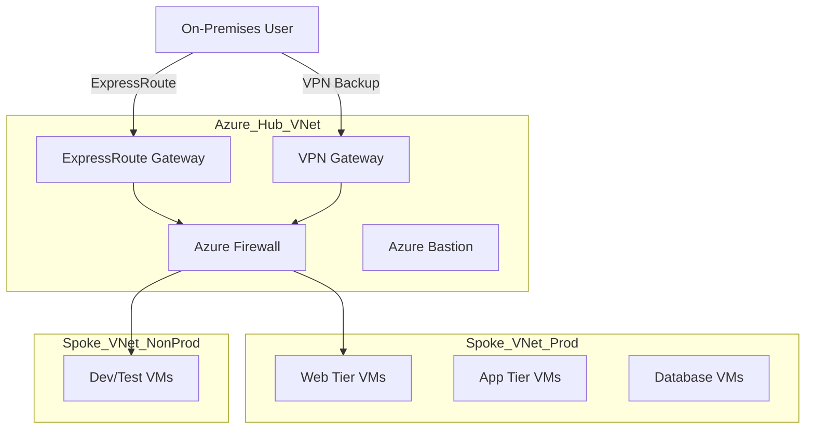

# Azure Data Center Migration for a Global Tech Firm

## Executive Summary & Business Value
This reference architecture outlines the strategic migration of on-premises data centers to Azure. The primary objective is to transition from a capital-intensive (CapEx) model to an operational (OpEx) model, enhancing business agility and disaster recovery capabilities.
- **Business Impact:** Projected 30% reduction in TCO over 3 years.
- **Strategic Goal:** Exit aging data centers to mitigate hardware failure risks.

## Leadership & Strategic Challenges
- **Stakeholder Alignment:** Successfully negotiated migration windows with 5 distinct business units, balancing operational continuity with the urgent need to exit the lease.
- **Change Management:** Led the cultural transition for the Operations team from "Server Hugging" (hardware maintenance) to "Cloud Governance" (policy & cost management).
- **Risk Mitigation:** Championed a "Pilot-First" strategy to validate performance, securing C-level confidence before the mass migration of 50+ production workloads.

## Design Decisions
- Use Azure Migrate for discovery, assessment, and migration.
- Lift-and-shift approach for initial migration, followed by modernization.
- Hybrid connectivity via VPN Gateway and ExpressRoute.
- Identity managed with Azure AD and hybrid sync.
- Data encrypted at rest and in transit.
- Monitoring via Azure Monitor and Log Analytics.

## Assumptions
- Source environment is VMware-based.
- All workloads are Windows Server 2016+ or Linux (supported distros).
- No unsupported legacy applications.
- Sufficient bandwidth for migration windows.
- Client provides access to on-premises environment.

## Azure Bill of Materials (BoM) & Cost Estimate

| Service | SKU / Tier | Quantity | Estimated Monthly Cost | Notes |
| :--- | :--- | :--- | :--- | :--- |
| **Azure Migrate** | Standard | 1 | Free | Assessment & Migration tool |
| **Virtual Machines** | D4s v5 (General Purpose) | 50 | ~$7,500 | Pay-as-you-go, Linux/Windows mix |
| **Managed Disks** | Premium SSD P10 (128GB) | 50 | ~$1,000 | OS Disks |
| **ExpressRoute** | Standard Circuit (1 Gbps) | 1 | ~$450 | Metered Data Plan |
| **ExpressRoute Gateway** | Standard | 1 | ~$150 | |
| **VPN Gateway** | VpnGw1 | 1 | ~$140 | Backup connectivity |
| **Azure Backup** | GRS Vault | 50 Instances | ~$500 | + Storage costs |
| **Azure Monitor** | Standard | 100 GB Ingestion | ~$250 | Log Analytics ingestion |
| **Bandwidth** | Outbound Data Transfer | 5 TB | ~$400 | Inter-region/Internet |
| **Total Estimated** | | | **~$10,390 / month** | *Excludes upfront migration costs* |

## Landing Zone Architecture

### High-Level Diagram


### Terraform Code Snippet (Hub Network)
```hcl
resource "azurerm_resource_group" "hub_rg" {
  name     = "rg-hub-network-001"
  location = "East US"
}

resource "azurerm_virtual_network" "hub_vnet" {
  name                = "vnet-hub-001"
  location            = azurerm_resource_group.hub_rg.location
  resource_group_name = azurerm_resource_group.hub_rg.name
  address_space       = ["10.0.0.0/16"]
}

resource "azurerm_subnet" "gateway_subnet" {
  name                 = "GatewaySubnet"
  resource_group_name  = azurerm_resource_group.hub_rg.name
  virtual_network_name = azurerm_virtual_network.hub_vnet.name
  address_prefixes     = ["10.0.1.0/24"]
}

resource "azurerm_public_ip" "er_gw_pip" {
  name                = "pip-er-gateway"
  location            = azurerm_resource_group.hub_rg.location
  resource_group_name = azurerm_resource_group.hub_rg.name
  allocation_method   = "Dynamic"
}

resource "azurerm_virtual_network_gateway" "er_gateway" {
  name                = "ergw-hub-001"
  location            = azurerm_resource_group.hub_rg.location
  resource_group_name = azurerm_resource_group.hub_rg.name

  type     = "ExpressRoute"
  vpn_type = "RouteBased"
  sku      = "Standard"

  ip_configuration {
    name                          = "vnetGatewayConfig"
    public_ip_address_id          = azurerm_public_ip.er_gw_pip.id
    private_ip_address_allocation = "Dynamic"
    subnet_id                     = azurerm_subnet.gateway_subnet.id
  }
}
```

## Implementation Plan

### Phase 1: Discovery & Assessment
- [ ] Deploy Azure Migrate appliance on-premises.
- [ ] Run discovery for 2-4 weeks to gather performance data.
- [ ] Create dependency mapping reports.
- [ ] Right-size VM recommendations.

### Phase 2: Landing Zone Setup
- [ ] Deploy Hub-Spoke network topology (Terraform).
- [ ] Configure ExpressRoute and VPN connectivity.
- [ ] Setup Identity (Azure AD Connect).
- [ ] Configure Azure Policy and RBAC.

### Phase 3: Migration (Wave 1 - Non-Critical)
- [ ] Replicate test workloads using ASR.
- [ ] Perform test failover in isolated VNet.
- [ ] Validate application functionality.
- [ ] Cutover non-prod workloads.

### Phase 4: Migration (Wave 2 - Critical)
- [ ] Schedule maintenance windows.
- [ ] Replicate production workloads.
- [ ] Final sync and cutover.
- [ ] Update DNS records.

### Phase 5: Optimization
- [ ] Review Azure Advisor recommendations.
- [ ] Implement cost controls (Budgets).
- [ ] Enable backup and DR for all migrated resources.

## RACI Matrix

| Activity | Cloud Architect | DevOps Engineer | Network Admin | Security Lead | Project Manager |
| :--- | :---: | :---: | :---: | :---: | :---: |
| **LZ Design** | R/A | C | C | C | I |
| **Network Setup** | C | I | R | C | I |
| **Migration Exec** | A | R | I | I | I |
| **Security Review** | I | I | I | R/A | I |
| **Sign-off** | A | I | I | I | R |

*R=Responsible, A=Accountable, C=Consulted, I=Informed*

## Success Metrics (KPIs)
- **Migration Velocity:** > 50 VMs migrated per wave.
- **Downtime:** Zero unplanned downtime during cutover windows.
- **Cost Adherence:** Actual Azure spend within +/- 5% of BoM estimate.

## Artifact Reusability Guide
- **Pattern Type:** Lift-and-Shift (Rehost).
- **Usage Scenario:** Use this artifact for any scenario involving VMware/Hyper-V to Azure migration where code refactoring is not immediately possible.
- **Customization Points:** Adjust the "ExpressRoute" bandwidth and "VM SKU" families based on the specific assessment report.
