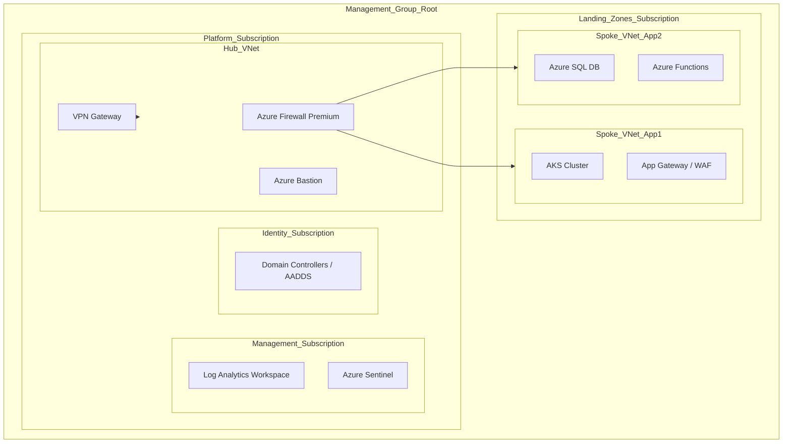

# Azure Landing Zone Implementation for a FinTech Startup

## Executive Summary & Business Value
This document defines the foundational "Landing Zone" architecture required to host secure, compliant financial workloads. It establishes a "Vending Machine" model for rapid subscription provisioning, ensuring that security and governance are baked in from day one.
- **Business Impact:** Reduces environment provisioning time from weeks to hours.
- **Strategic Goal:** Achieve regulatory compliance (SOC2/PCI-DSS) readiness immediately upon deployment.

## Leadership & Strategic Challenges
- **Compliance vs. Velocity:** Bridged the gap between Security and Engineering by implementing "Policy-as-Code," satisfying auditors without slowing down developers.
- **Cloud Operating Model:** Defined the RACI matrix for the new Cloud Center of Excellence (CCoE), establishing clear ownership of networking, identity, and application resources.
- **Executive Reporting:** Established a monthly "Cloud Governance Scorecard" for the CTO, tracking compliance drift and security posture improvements.

## Design Decisions
- Use Azure Landing Zone Accelerator (CAF).
- Hub-and-spoke network topology.
- Centralized logging and security with Azure Security Center and Sentinel.
- Policy enforcement via Azure Policy and Blueprints.
- Resource organization by subscription and management group.

## Assumptions
- Greenfield deployment (no existing Azure resources).
- Startup has no regulatory blockers for cloud adoption.
- All workloads are containerized or PaaS-ready.
- Client will use Azure DevOps for CI/CD.

## Azure Bill of Materials (BoM) & Cost Estimate

| Service | SKU / Tier | Quantity | Estimated Monthly Cost | Notes |
| :--- | :--- | :--- | :--- | :--- |
| **Azure Firewall** | Premium | 1 | ~$1,250 | Hub VNet Security |
| **DDoS Protection** | Network Protection | 1 | ~$3,000 | Enterprise-grade protection |
| **Azure Sentinel** | Pay-as-you-go | 50 GB/day | ~$2,000 | SIEM & SOAR |
| **Log Analytics** | Pay-as-you-go | 50 GB/day | ~$1,500 | Centralized Logging |
| **Azure Bastion** | Standard | 1 | ~$200 | Secure VM Access |
| **Key Vault** | Standard | 2 | ~$10 | Secrets Management |
| **Azure Policy** | - | - | Free | Governance |
| **Cost Management** | - | - | Free | Budgeting |
| **Total Estimated** | | | **~$7,960 / month** | *Base infrastructure only* |

## Landing Zone Architecture

### High-Level Diagram


### Terraform Code Snippet (Management Groups)
```hcl
resource "azurerm_management_group" "org_root" {
  display_name = "FinTech-Root"
}

resource "azurerm_management_group" "platform" {
  display_name               = "Platform"
  parent_management_group_id = azurerm_management_group.org_root.id
}

resource "azurerm_management_group" "landing_zones" {
  display_name               = "Landing Zones"
  parent_management_group_id = azurerm_management_group.org_root.id
}

resource "azurerm_management_group" "decommissioned" {
  display_name               = "Decommissioned"
  parent_management_group_id = azurerm_management_group.org_root.id
}

resource "azurerm_policy_assignment" "allowed_locations" {
  name                 = "allowed-locations"
  scope                = azurerm_management_group.org_root.id
  policy_definition_id = "/providers/Microsoft.Authorization/policyDefinitions/e56962a6-4747-49cd-b67b-bf8b01975c4c"
  description          = "Restrict resource deployment to specific regions."
  display_name         = "Allowed Locations"

  parameters = <<PARAMETERS
{
  "listOfAllowedLocations": {
    "value": [ "East US", "West US" ]
  }
}
PARAMETERS
}
```

## Implementation Plan

### Phase 1: Governance & Identity
- [ ] Define Management Group hierarchy.
- [ ] Configure Azure AD (Entra ID) groups and PIM.
- [ ] Apply core Azure Policies (Locations, SKUs, Tags).

### Phase 2: Network Topology
- [ ] Deploy Hub VNet with Azure Firewall and Bastion.
- [ ] Configure DDoS Network Protection.
- [ ] Setup ExpressRoute/VPN connectivity.

### Phase 3: Management & Monitoring
- [ ] Create Central Log Analytics Workspace.
- [ ] Enable Azure Sentinel.
- [ ] Configure diagnostic settings for all resources to send to LA.

### Phase 4: Spoke Vending Machine
- [ ] Create Terraform modules for Spoke VNet creation.
- [ ] Automate VNet peering to Hub.
- [ ] Validate routing (UDRs) through Firewall.

## RACI Matrix

| Activity | Cloud Architect | Security Engineer | Platform Engineer | App Team Lead | CTO |
| :--- | :---: | :---: | :---: | :---: | :---: |
| **Governance Design** | R | C | I | I | A |
| **Security Config** | C | R/A | I | I | I |
| **Network Deploy** | R | C | A | I | I |
| **Spoke Creation** | A | I | R | C | I |
| **App Deployment** | C | I | I | R/A | I |

*R=Responsible, A=Accountable, C=Consulted, I=Informed*

## Success Metrics (KPIs)
- **Security Score:** Maintain Azure Secure Score > 90%.
- **Compliance:** 100% adherence to assigned Azure Policies (deny-by-default).
- **Operational Efficiency:** < 1 hour turnaround for new Spoke VNet provisioning.

## Artifact Reusability Guide
- **Pattern Type:** Hub-and-Spoke / Enterprise Scale.
- **Usage Scenario:** Mandatory baseline for all new Azure onboardings requiring hybrid connectivity or strict governance.
- **Customization Points:** Modify `azurerm_policy_assignment` parameters for different regulatory frameworks (e.g., HIPAA vs. PCI).
