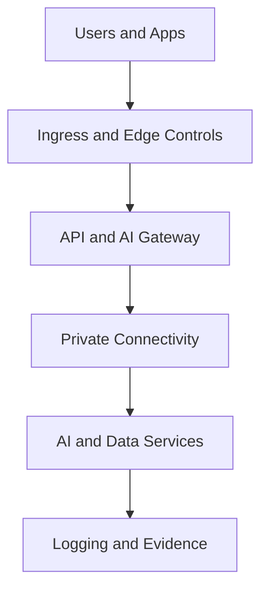
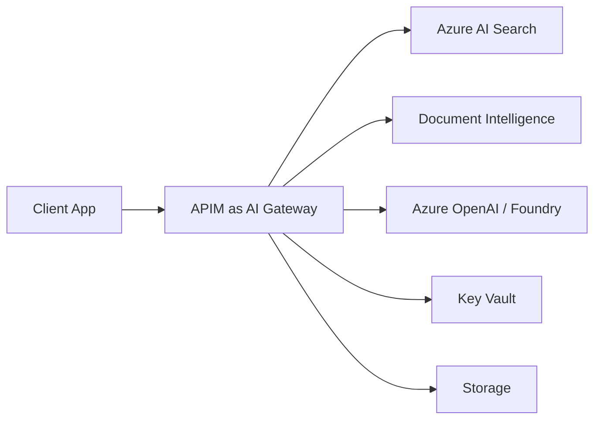
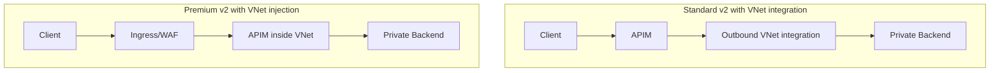
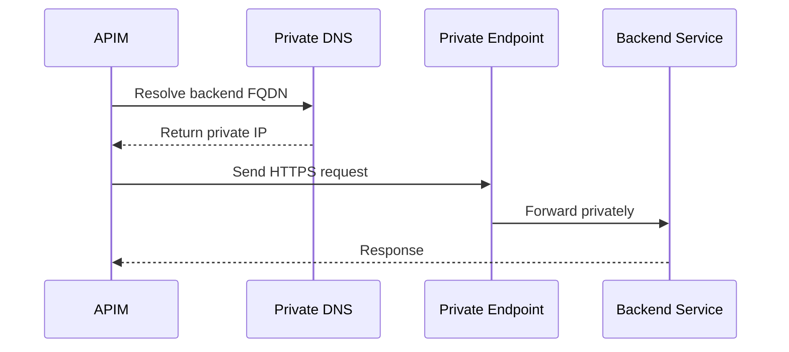
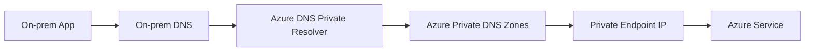
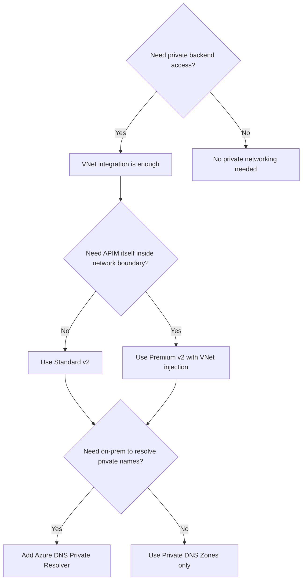

# The Compliance Gap in AI Platforms Is Not Security. It Is Proof.

The architecture looked secure.

Cloudflare at the edge.  
Palo Alto inspecting traffic.  
Azure API Management in place.  
Private endpoints everywhere.  

Then the audit question landed:

**Can you prove the exact path every request takes, and show which control owns each step?**

That is where many AI platform designs start to wobble.

## The architectural shift

A lot of teams still treat this as a gateway selection exercise.

It is not.

For regulated AI workloads, the real unit of architecture is the **landing zone**.

## APIM is now an AI Gateway

In an AI platform, APIM becomes the control point for:
- model and service access
- token validation
- throttling and quotas
- policy enforcement

## The mistake most teams make

They confuse **private connectivity** with **network control**.

### VNet integration vs VNet injection

- **VNet integration** means APIM can reach private backends.
- **VNet injection** means APIM itself becomes part of the private network boundary.

## The most important line in the architecture

**Private Endpoint does not change routing by itself.  
DNS changes routing.**

## Hybrid DNS pattern

If on-premises needs to resolve Azure private names, Private DNS Zones alone are not enough.

## Decision guide

## Final thought

Security protects.  
Compliance proves.  
Identity authorizes.  
DNS directs.  

Private endpoints hide the door.  
DNS tells traffic where to go.  
Identity decides who gets in.  
Compliance starts when you can prove all three.
