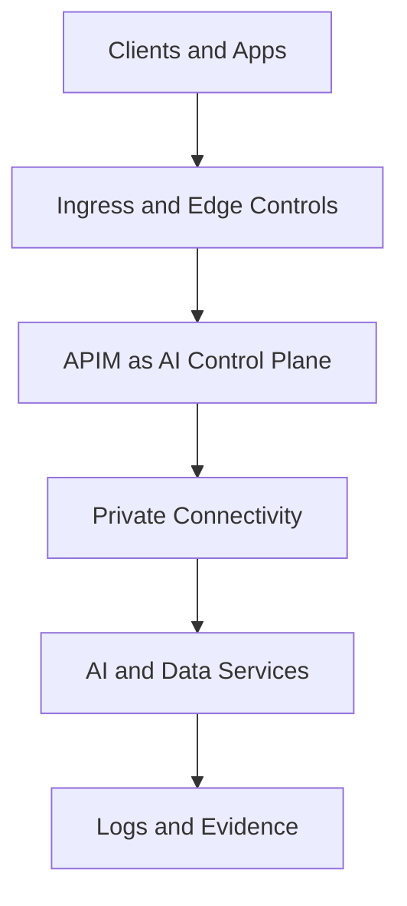
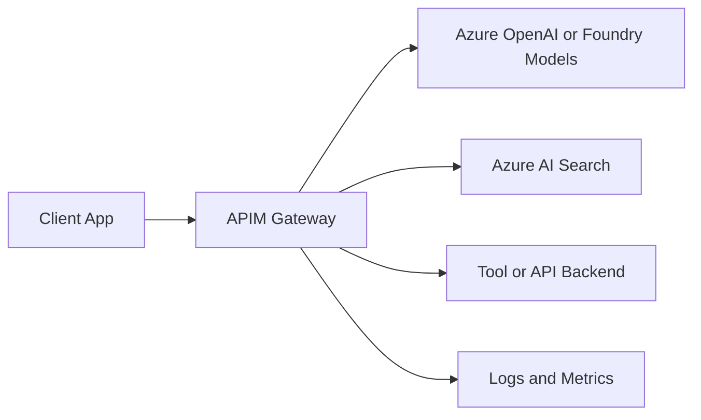
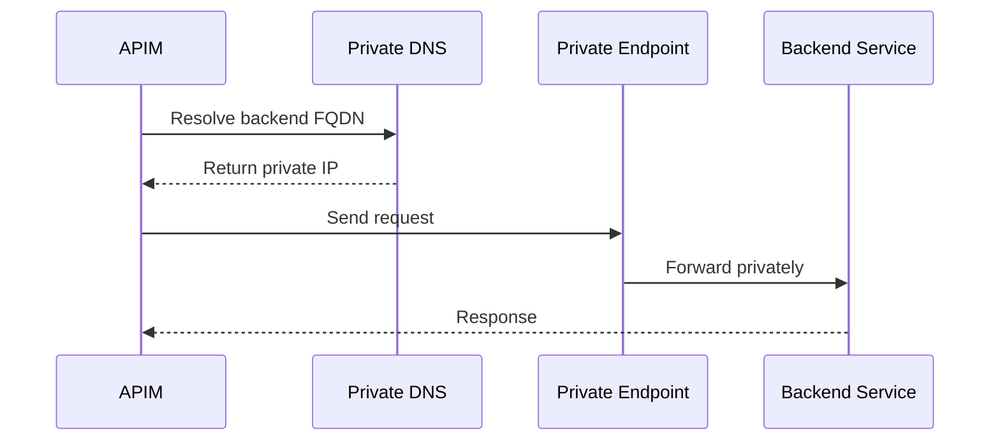
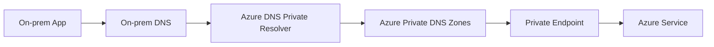

# The Compliance Gap in AI Platforms Is Not Security. It Is Proof.

Many AI platforms look secure in a diagram and still fail the audit question that matters:

**Can you prove the exact request path and show which control owns each step?**

That is the compliance gap.

## Executive summary

- The gap is not usually missing perimeter tooling. It is missing evidence.
- APIM should be treated as the AI control plane, not just a reverse proxy.
- Private Endpoint does not change routing by itself. DNS determines the path.
- Standard v2 can be enough for private backend access. Premium v2 is the fit when the gateway itself must sit inside the private boundary.
- Compliance evidence has to be designed up front: policy state, RBAC, DNS resolution, telemetry, and retained logs.

## The architectural shift

A lot of teams still treat this as a gateway selection exercise.

It is not.

For regulated AI workloads, the real unit of architecture is the **landing zone**: ingress, identity, private connectivity, DNS, policy enforcement, monitoring, and evidence designed as one control system.



## The Foundry agent gateway

As teams move from chat interfaces to agents and tool use, the gateway role expands.

It is no longer only about authentication and routing. It becomes the place to:

- govern model access
- enforce quotas
- standardize backend connections
- produce telemetry for operations and audit



## Five takeaways

1. The AI gateway is a capability set inside APIM, not a separate product category.
2. Token-based limits matter more than request counts for LLM workloads.
3. Managed identity is the right default for backend authentication where supported.
4. Gateway policy belongs in the compliance story because it is the active enforcement layer.
5. Evidence quality matters as much as network isolation quality.

## Policy enforcement

Network routing is passive.

APIM policy is active enforcement.

That is where you validate client identity, apply rate and token controls, and authenticate to AI backends with managed identity.

```xml
<policies>
  <inbound>
    <base />
    <validate-jwt header-name="Authorization">
      <openid-config url="https://login.microsoftonline.com/{{tenant-id}}/v2.0/.well-known/openid-configuration" />
      <audiences>
        <audience>{{apim-app-registration-client-id}}</audience>
      </audiences>
    </validate-jwt>

    <llm-token-limit
      counter-key="@(context.Subscription.Id)"
      tokens-per-minute="50000"
      estimate-prompt-tokens="true" />

    <authentication-managed-identity
      resource="https://cognitiveservices.azure.com"
      output-token-variable-name="msi-access-token" />
  </inbound>
</policies>
```

Be precise about what each control proves.

- Token policy helps with quota governance.
- Managed identity reduces secret sprawl.
- Harm-content controls are not the same as PII-specific controls.

## The mistake most teams make

Teams often collapse three different questions into one:

- Can APIM reach private backends?
- Is the gateway itself inside the private boundary?
- Can the team prove there is no unmanaged bypass path?

Those are related, but not identical.

## DNS and network

**Private Endpoint does not change routing by itself. DNS changes routing.**

If name resolution is wrong, the architecture is wrong even if the private endpoint exists.



Use Private DNS Zones when Azure resources resolve private names inside Azure.

Use Azure DNS Private Resolver when name resolution must cross boundaries, especially between on-premises and Azure.



## Defensible AI architecture

| Control objective | Engineering mechanism | Evidence |
|---|---|---|
| Prevent direct public access | Disable public network access where supported and enforce private endpoints | Policy state, network config, denied-path test results |
| Centralize identity enforcement | Require JWT validation and APIM managed identity for backend calls | Role assignments, policy config, failed direct-access logs |
| Prove request lineage | Centralized telemetry in App Insights or Log Analytics | Correlated KQL showing client -> APIM -> backend |
| Control AI consumption | Token-based limits and backend segmentation | Policy definitions, token metrics, exception records |

## Threat model

| Threat | Failure mode | Mitigation |
|---|---|---|
| Network bypass | Clients reach AI services outside the governed path | Private endpoints, restricted ingress, denied-path validation |
| Identity bypass | A caller reaches the backend outside gateway-owned identity flow | JWT validation, RBAC hardening, managed-identity-only access |
| Evidence gaps | The platform works but cannot prove who called what and when | Correlated logs, retention, documented control ownership |
| Unsafe model output | Harmful or sensitive content passes without review | Use the right moderation and PII-specific controls where required |

## Decision matrix

| Option | Use when | Tradeoff |
|---|---|---|
| APIM Standard v2 + private backends | You need governed private access to backends | Lower cost, but not gateway-side isolation |
| APIM Premium v2 injected | The gateway itself must sit inside the private boundary | Stronger boundary narrative, more cost and complexity |
| Private DNS Resolver | You need private name resolution across Azure and on-premises | Useful for hybrid, unnecessary for many Azure-only designs |

## Recommendations

- Start the design review by naming the control objective, not the SKU.
- Document the ingress path, identity path, DNS path, and telemetry path for each request class.
- Use Standard v2 when private backend access is enough.
- Move to Premium v2 when gateway-boundary isolation is explicitly required.
- Write down the evidence package before go-live.

## Final thought

Security protects.

Compliance proves.

Identity authorizes.

DNS directs.

Private endpoints hide the door.  
DNS tells traffic where to go.  
Identity decides who gets in.  
A regulated AI platform is credible only when you can prove all three.
