# Azure Multi-Region AI Platform Architecture

This is a **Microsoft-style enterprise architecture diagram** engineered specifically for the `mg-landingzones` framework, documenting a secure Multi-Region AI infrastructure using APIM mediation and Hub-Spoke topologies. 

It explicitly includes all enterprise controls across Connectivity, Security, Shared Services, non-Production boundaries, Private Endpoints, and RAG execution flows.

## Mermaid Representation 

```mermaid
flowchart TB
    %% Micosoft Azure Style Colors & Shapes
    classDef global fill:#0078D4,stroke:#005A9E,stroke-width:2px,color:#FFF,border-radius:6px;
    classDef mg fill:#F3F2F1,stroke:#605E5C,stroke-width:2px,stroke-dasharray: 4 4,color:#323130;
    classDef sub fill:#FFFFFF,stroke:#0078D4,stroke-width:2px,stroke-dasharray: 5 5,color:#0078D4;
    classDef vnet fill:#E5F0FF,stroke:#0078D4,stroke-width:1px,color:#0078D4;
    classDef snet fill:#FFFFFF,stroke:#0078D4,stroke-width:1px,stroke-dasharray: 2 2,color:#323130;
    classDef res fill:#0078D4,stroke:#005A9E,stroke-width:1px,color:#FFF,border-radius:4px;
    classDef ai fill:#00BCFA,stroke:#005A9E,stroke-width:1px,color:#FFF,border-radius:4px;
    classDef sec fill:#107C41,stroke:#0B5A2F,stroke-width:1px,color:#FFF,border-radius:4px;
    classDef note fill:#FFF4CE,stroke:#D83B01,stroke-width:1px,color:#323130;

    Users((Users / Clients))
    
    subgraph Global [Global Entry Layer]
        direction LR
        TM[Azure Traffic Manager<br/>Current Global Routing]:::global
        AFD[Azure Front Door<br/>Future Enhancement Option]:::global
    end
    
    Users -->|HTTPS| TM
    TM -.->|Strategic Upgrade| AFD

    Notes["<div style='text-align:left'><b>Executive Architecture Decisions:</b><br/>1. Traffic Manager: DNS-based global routing<br/>2. Azure Front Door: Strategic future option<br/>3. APIM multi-region requires Premium SKU<br/>4. GPT-4o PTU: Deployed in UAE North<br/>5. UK Central DR: Secondary model or degraded mode<br/>6. AI Search: Requires secondary recovery pattern<br/>7. Doc Intel: Custom models copied to DR region<br/>8. Connectivity: Private endpoints only for AI<br/>9. Identity: Managed identity over API keys<br/>10. Topology: Hub-Spoke Landing Zone</div>"]:::note

    subgraph MG_Platform [Management Group: mg-platform]
        direction TB
        
        subgraph Sub_Conn [Subscription: sub-connectivity-01]
            direction LR
            subgraph Hub_UAEN [Primary Hub: UAE North]
                direction TB
                vnet_hub_uaen[[vnet-hub-uaen-01 : 10.0.0.0/16]]:::vnet
                afw_uaen[Azure Firewall<br/>10.0.1.0/24]:::sec
                bastion_uaen[Azure Bastion<br/>10.0.2.0/24]:::sec
                ergw_uaen[VPN/ER Gateway<br/>10.0.3.0/24]:::res
                dnspr_uaen[DNS Private Resolver<br/>10.0.4.0/24]:::res
            end
            
            subgraph Hub_UKC [DR Hub: UK Central]
                direction TB
                vnet_hub_ukc[[vnet-hub-ukc-01 : 10.100.0.0/16]]:::vnet
                afw_ukc[Azure Firewall<br/>10.100.1.0/24]:::sec
                bastion_ukc[Azure Bastion<br/>10.100.2.0/24]:::sec
                ergw_ukc[VPN/ER Gateway<br/>10.100.3.0/24]:::res
                dnspr_ukc[DNS Private Resolver<br/>10.100.4.0/24]:::res
            end
            
            vnet_hub_uaen <==>|Global VNet Peering| vnet_hub_ukc
        end

        subgraph Sub_Sec [Subscription: sub-security-01]
            rg_sec(rg-security-platform-01)
            mdc[Microsoft Defender for Cloud]:::sec
            sentinel[Microsoft Sentinel]:::sec
            policy[Azure Policy & RBAC centrally managed]:::sec
        end
    end

    subgraph MG_LandingZones [Management Group: mg-landingzones]
        direction TB
        
        subgraph Sub_Shared [Subscription: sub-sharedservices-01]
            direction LR
            subgraph Shared_UAEN [Shared: UAE North]
                kv_uaen[Key Vault<br/>kv-shared-uaen-01]:::sec
                law_uaen[Log Analytics<br/>law-shared-01]:::res
                appi_uaen[Application Insights<br/>appi-ai-prod-01]:::res
                pdns_uaen[Private DNS Zones]:::res
            end
            subgraph Shared_UKC [Shared: UK Central]
                kv_ukc[Key Vault<br/>kv-shared-ukc-01]:::sec
            end
        end

        subgraph MG_Prod [Management Group: mg-prod]
            subgraph Sub_Prod_AI [Subscription: sub-prod-ai-01]
                direction LR
                
                subgraph Prod_UAEN [Application Landing Zone Primary: UAE North - rg-ai-prod-uaen-01]
                    direction TB
                    vnet_uaen[[vnet-ai-prod-uaen-01 : 10.10.0.0/16]]:::vnet
                    
                    subgraph snet_appgw_uaen [snet-appgw-uaen-01 : 10.10.1.0/24]
                        agw_uaen[App Gateway + WAF<br/>agw-ai-prod-uaen-01]:::sec
                    end
                    subgraph snet_apim_uaen [snet-apim-uaen-01 : 10.10.2.0/24]
                        apim_uaen[API Management Gateway<br/>apim-ai-prod-uaen-01]:::res
                    end
                    subgraph snet_app_uaen [snet-app-uaen-01 : 10.10.3.0/24]
                        app_uaen[App Service / AI Orchestrator<br/>app-ai-orch-prod-uaen-01]:::res
                    end
                    subgraph snet_pe_uaen [snet-pe-uaen-01 : 10.10.4.0/24 Private Endpoints]
                        srch_uaen[(Azure AI Search<br/>srch-ai-prod-uaen-01)]:::ai
                        oai_uaen[Azure AI Foundry GPT-4o PTU<br/>oai-gpt4o-prod-uaen-01]:::ai
                        di_uaen[AI Document Intelligence<br/>di-ai-prod-uaen-01]:::ai
                        st_uaen[(Storage / Knowledge Base<br/>stai-prod-uaen-01)]:::ai
                    end
                    
                    agw_uaen -->|WAF Inspected| apim_uaen
                    apim_uaen -->|AI Gateway Routing| app_uaen
                    app_uaen -->|RAG Query| srch_uaen
                    app_uaen -->|Prompt| oai_uaen
                    st_uaen -->|Document Ingestion| di_uaen
                    di_uaen -->|Chunk / Vectorize| srch_uaen
                end

                subgraph Prod_UKC [Application Landing Zone DR: UK Central - rg-ai-prod-ukc-01]
                    direction TB
                    vnet_ukc[[vnet-ai-prod-ukc-01 : 10.20.0.0/16]]:::vnet
                    
                    subgraph snet_appgw_ukc [snet-appgw-ukc-01 : 10.20.1.0/24]
                        agw_ukc[App Gateway + WAF<br/>agw-ai-prod-ukc-01]:::sec
                    end
                    subgraph snet_apim_ukc [snet-apim-ukc-01 : 10.20.2.0/24]
                        apim_ukc[API Management Gateway<br/>apim-ai-prod-ukc-01]:::res
                    end
                    subgraph snet_app_ukc [snet-app-ukc-01 : 10.20.3.0/24]
                        app_ukc[App Service / AI Orchestrator<br/>app-ai-orch-prod-ukc-01]:::res
                    end
                    subgraph snet_pe_ukc [snet-pe-ukc-01 : 10.20.4.0/24 Private Endpoints]
                        srch_ukc[(Azure AI Search<br/>srch-ai-dr-ukc-01)]:::ai
                        oai_ukc[Azure AI Foundry Warm DR<br/>oai-gpt4o-dr-ukc-01]:::ai
                        di_ukc[AI Document Intelligence<br/>di-ai-dr-ukc-01]:::ai
                        st_ukc[(Storage / Knowledge Base<br/>stai-dr-ukc-01)]:::ai
                    end
                    
                    agw_ukc -->|WAF Inspected| apim_ukc
                    apim_ukc -->|AI Gateway Routing| app_ukc
                    app_ukc -->|RAG Query| srch_ukc
                    app_ukc -->|Prompt| oai_ukc
                    st_ukc -->|Document Ingestion| di_ukc
                    di_ukc -->|Chunk / Vectorize| srch_ukc
                end
            end
        end

        subgraph MG_NonProd [Management Group: mg-nonprod]
            subgraph Sub_NonProd_AI [Subscription: sub-nonprod-ai-01]
                direction LR
                rg_nonprod(rg-ai-nonprod-uaen-01)
                vnet_nonprod[[vnet-ai-nonprod-uaen-01]]:::vnet
                np_stack[Lower-Cost AI Stack<br/>Separate Policy Boundary]:::ai
            end
        end
    end

    %% Network & Authorization Flows
    TM -->|Primary User Traffic| agw_uaen
    TM -->|DR Failover Traffic| agw_ukc
    
    vnet_uaen <==>|Spoke to Hub Peering| vnet_hub_uaen
    vnet_ukc <==>|Spoke to Hub Peering| vnet_hub_ukc
    
    app_uaen -.->|Managed Identity Authorization| kv_uaen
    app_ukc -.->|Managed Identity Authorization| kv_ukc

    snet_pe_uaen -.->|Private DNS Resolution| dnspr_uaen
    snet_pe_ukc -.->|Private DNS Resolution| dnspr_ukc
```

## How to Work With This Diagram
1. The raw `.md` can be opened in simple markdown renderers or Visual Studio Code.
2. For absolute highest quality output, save the raw text block above into a `.mermaid` file.
3. Because you are using Draw.io: the Agent has actively passed this source code to the local Draw.io instance. It supports direct extraction natively!
