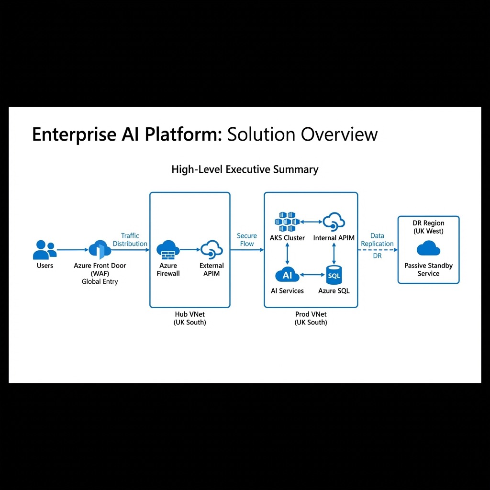
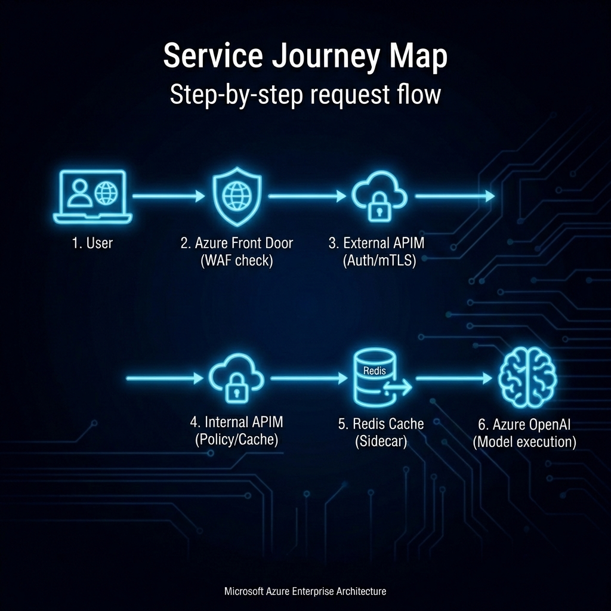
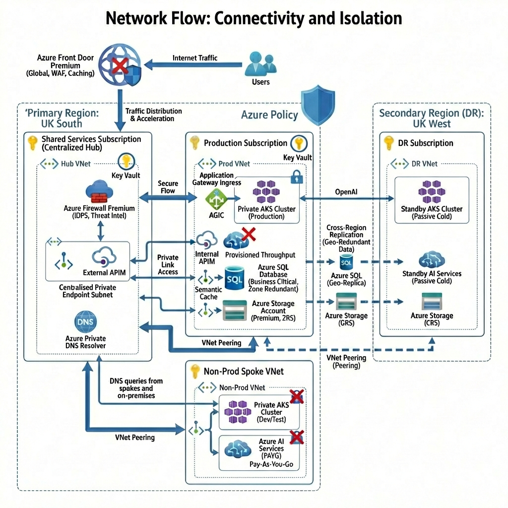
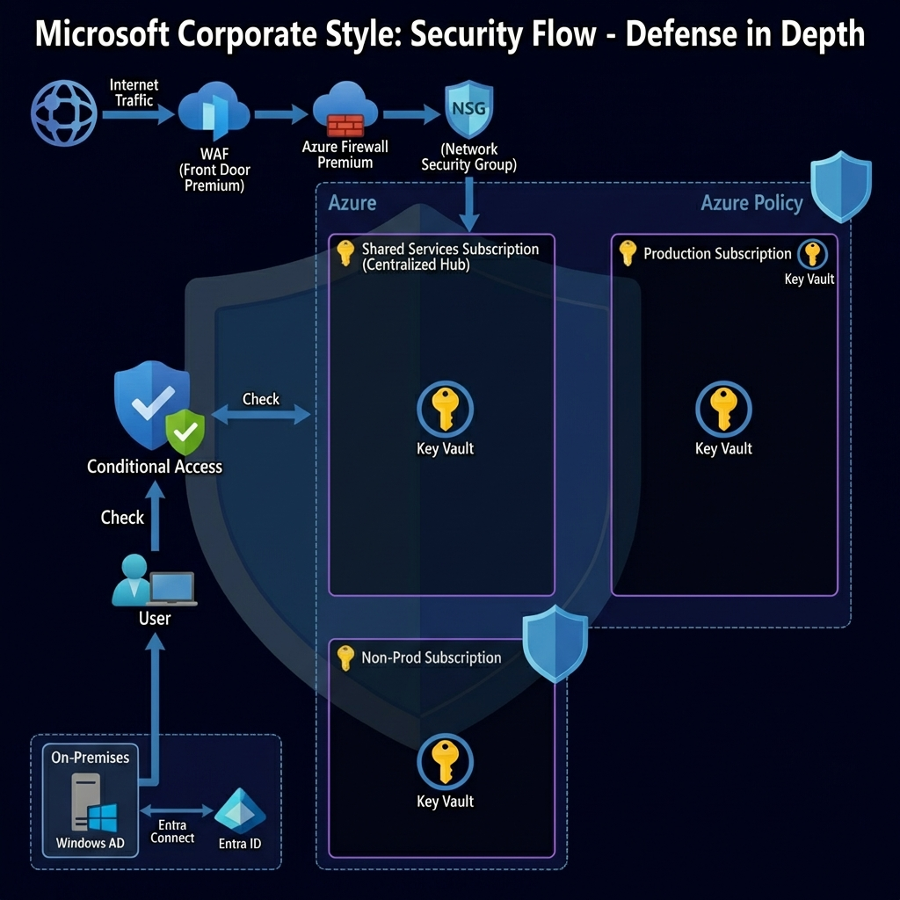
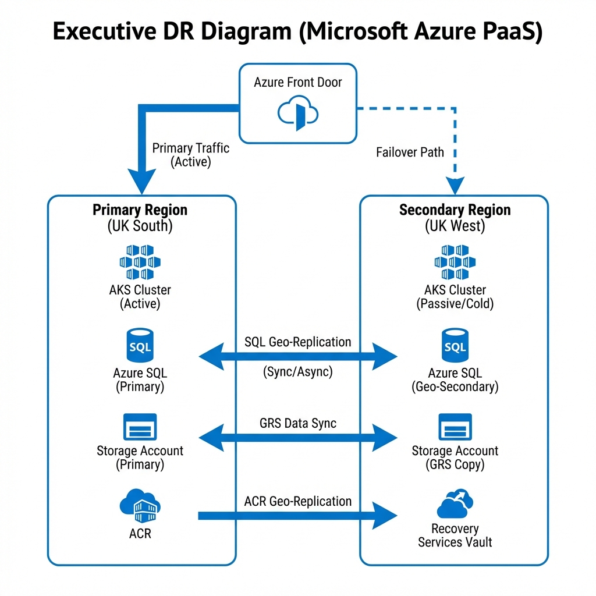

## 1. Architectural Strategy

### 1.1 Design Principles
- **Security by Design**: All traffic is private by default. Public endpoints are explicitly disabled.
- **Regional Isolation**: UK South is the primary boundary for all AI inference to satisfy data residency.
- **Zero Trust Identity**: managed identities and Workload Identity are used exclusively; no shared keys.
- **Operational Simplicity**: Centralized Hub for DNS and Firewall reduces the burden on individual spoke owners.

### 1.2 Design Decisions
- **Decision**: APIM placed *after* AKS.
  - *Rationale*: To act as an AI Gateway governing PTU tokens and providing model-specific audit trails.
- **Decision**: AKS hosts both UI and Backend.
  - *Rationale*: Unified security perimeter and simplified deployment via a single VNet boundary.
- **Decision**: Centralized Hub for PEs and DNS.
  - *Rationale*: Prevents DNS "hairpinning" and provides a single management plane for Private Links.

### 1.3 Design Assumptions
- **PTU Availability**: Assumes 50 PTU units are pre-allocated in UK South for the subscription, split across 3 deployments (30 Prod / 10 Test / 10 Dev).
- **Redis Cache**: Assumes Azure Redis Cache Premium (P1) is deployed for semantic caching at the APIM layer.
- **Connectivity**: Assumes the user has the necessary permissions to create VNet peerings across subscriptions.
- **Subscription Limits**: Assumes the 'Shared Services' sub has enough quota for the Premium Firewall and Front Door.

### 1.4 Risks & Mitigations
- **Risk**: Regional capacity exhaustion in UK South.
  - *Mitigation*: The standby UK West environment acts as a cold/warm recovery site.
- **Risk**: Latency introduced by double-gatekeeping (AFD + AppGW + APIM).
  - *Mitigation*: Using Private Link origins, AGIC's direct-pod-routing, and Redis semantic caching to minimize hops and repeated AI calls.
- **Risk**: Complexity of Multi-Subscription management.
  - *Mitigation*: Use of Terraform for unified, declarative infrastructure state.

---

## 2. High-Level Design (The Global Blueprint)



---

## 2. Low-Level Design (LLD): Detailed Schemas

### 2.1 Network IP Schema & Subnetting
Following CAF standards, we use a Hub-and-Spoke topology with non-overlapping IP ranges.

| Subnet Name | Subscription | CIDR Range | Purpose |
| :--- | :--- | :--- | :--- |
| `snet-firewall` | Shared Hub | `10.100.1.0/26` | Reserved for Azure Firewall Premium. |
| `snet-shared-pe` | Shared Hub | `10.100.2.0/24` | Centralized Private Endpoints for all spokes. |
| `snet-dns-resolver`| Shared Hub | `10.100.3.0/28` | Private DNS Resolver (Inbound/Outbound). |
| `snet-aks-nodes` | Prod Spoke | `10.1.1.0/24` | AKS Node Pool (Private IP space). |
| `snet-appgw` | Prod Spoke | `10.1.2.0/24` | Regional Gateway (AGIC) Entry Point. |
| `snet-ai-be` | Prod Spoke | `10.1.3.0/24` | Backend AI Services (SQL, Storage). |
| `snet-redis` | Prod Spoke | `10.1.4.0/28` | Azure Redis Cache Premium (VNet Injection). |

> [!TIP]
> **Junior's Pitfall**: Always use `/26` or larger for the Firewall subnet; Azure requires it for scaling and upgrades.

### 2.2 DNS Strategy: "How do the VNets find each other?"
We use **Azure Private DNS Zones** (e.g., `privatelink.openai.azure.com`).
1. **Centralize**: All DNS Zones are hosted in the **Shared Hub Subscription**.
2. **Link**: Every Spoke VNet MUST be linked to these DNS Zones.
3. **Resolve**: The **Private DNS Resolver** in the Hub handles requests from on-premises or other regions.

### 2.3 Route Tables (UDR) & Traffic Inspection
To ensure the Firewall inspects all traffic, apply a **Route Table** to the AKS and AI subnets:
*   **Route Name**: `to-firewall-default`
*   **Address Prefix**: `0.0.0.0/0`
*   **Next Hop Type**: `Virtual Appliance`
*   **Next Hop Address**: `10.100.1.4` (Internal IP of Azure Firewall)

---

## 3. Governance & Naming Convention (CAF Standard)

| Resource Type | Convention Template | Example |
| :--- | :--- | :--- |
| Virtual Network | `vnet-{env}-{region}-{app}` | `vnet-shared-uks-ai` |
| Subnet | `snet-{purpose}` | `snet-aks-nodes` |
| Managed Identity| `id-{app}-{purpose}` | `id-ukl-aks-workload` |
| Key Vault | `kv-{app}-{env}` | `kv-ukl-prod-001` |

---

## 4. Junior-to-Senior Glossary

- **PTU (Provisioned Throughput Unit)**: Fixed, reserved capacity. Like a "Private Reservation" at a restaurant—you pay for the table whether you eat or not, but you're guaranteed a seat.
- **AGIC (App Gateway Ingress Controller)**: A "Smart Bridge" between Kubernetes and the Azure Network. It translates K8s ingress rules directly into App Gateway rules.
- **Private Link Service (PLS)**: Allows a service (like App Gateway) to be "called" privately from another region (like Front Door) across the Microsoft backbone.
- **Workload Identity**: A modern way to give a "Token" to a pod. No passwords required.

---

## 5. Implementation Checklist: Command Reference

### 5.1 Pre-Deployment
1.  **Register Providers**: 
    ```bash
    az provider register --namespace Microsoft.ContainerService
    az provider register --namespace Microsoft.CognitiveServices
    az provider register --namespace Microsoft.Cache
    ```
2.  **Verify PTU Quota**: Check Azure Portal -> Subscriptions -> Quotas for `GPT-4 (Provisioned)`. Ensure 50 PTU available.

### 5.2 Terraform Deployment
3.  **Deploy Hub**: `terraform apply -target=module.hub`
4.  **Deploy Spoke**: `terraform apply -target=module.spoke_prod`
5.  **Deploy Redis Cache**: `terraform apply -target=module.redis`
6.  **Deploy OpenAI with PTU Split**: `terraform apply -target=module.openai`
7.  **Deploy Policy (MCSB v2)**: `terraform apply -target=module.policy`

### 5.3 Verification Steps
8.  **Verify DNS**: From an AKS Pod, run `nslookup ukl-openai.privatelink.openai.azure.com`. It MUST return a `10.100.x.x` address, not a public one.
9.  **Verify Redis**: Test connection from APIM: `redis-cli -h <redis-hostname> -p 6380 -a <access-key> --tls PING`
10. **Verify PTU Deployments**: Check Azure Portal -> OpenAI -> Deployments. Should see 3 deployments: `gpt4-prod-deployment` (30 PTU), `gpt4-test-deployment` (10 PTU), `gpt4-dev-deployment` (10 PTU).
11. **Test Semantic Caching**: Send identical prompt twice to APIM, second response should be <50ms (cache hit).

---

## 6. Operation Management: Tracking AI Saturation

Use **Azure Monitor for OpenAI** to track:
- `Active Managed PTU Utilization`: If this hits 90%, users will experience latency.
- `Request Throttling`: Indicates when the APIM QoS policy is kicking in to protect production traffic.

- `Request Throttling`: Indicates when the APIM QoS policy is kicking in to protect production traffic.

---

---

## 8. The "Airport Analogy": For Non-Technical Stakeholders

To help outside stakeholders understand this complex architecture, think of the entire solution as a **High-Security Private Airport**.

### 8.1 Azure Front Door = "The Main Terminal Entrance"
It’s the first thing people see. It checks if you’re a legitimate traveler (WAF) and speeds you through to the right gate based on where you’re going.

### 8.2 Azure Firewall = "Security & Customs"
Even if you’re through the front door, you can’t get to the plane without being scanned. The Firewall (IDPS) looks inside every "suitcase" (data packet) to ensure there’s nothing dangerous inside before letting you onto the runway.

### 8.3 Private AKS = "The High-Security Departure Lounge"
This is the restricted area where all the "work" happens. Only authorized staff and passengers can enter. In our solution, this is where the software lives, hidden away from the public street.

### 8.4 APIM = "The VIP Concierge"
The Concierge (API Management) stands at the door of the first-class cabin. They check your ID, count how many drinks (tokens) you’re allowed to have, and make sure the VIP area doesn't get overcrowded.

### 8.5 Redis Cache = "The Concierge's Memory Book"
The Concierge keeps a **Memory Book** (Redis Cache) of recent conversations. If you ask the same question someone just asked 5 minutes ago, the Concierge doesn't need to bother the pilot (GPT-4)—they just read the answer from their book. This saves time and keeps the pilot fresh for new questions.

### 8.6 GPT-4 (PTU) = "The Reserved First-Class Cabin (30/10/10 Split)"
Unlike a regular flight where anyone can buy a seat (PAYG), PTU is a **Private Jet** waiting on the tarmac. We have **three separate jets**: a big one for Production (30 seats), and two smaller ones for Testing and Development (10 seats each). This way, test flights never delay the VIPs.

### 8.7 Private Link = "The Underground Tunnels"
Instead of walking through the public parking lot to get from the terminal to the office, everyone uses **Invisible Underground Tunnels**. To an outsider, it looks like nothing is moving, but the passengers are actually zipping between buildings in complete privacy.

---

## 9. Architectural Rationale: AKS vs. Azure Container Apps (ACA)

For a "Regulator-Ready" platform, **AKS** was the necessary choice over the serverless **Azure Container Apps (ACA)** for the following reasons:

### 9.1 Control & Customization
- **AKS**: Provides full access to the Kubernetes API, allowing for advanced security guardrails like **Azure Policy for Kubernetes** and fine-grained cluster hardening.
- **ACA**: Abstracted and serverless. While easier to manage, it restricts the deeper configuration required for strict regulatory audits.

### 9.2 Advanced Networking (AKS Wins)
- **AKS**: Supports **Azure CNI**, where every pod gets a real IP on the internal VNet. This allows the **Azure Firewall IDPS** to perform per-pod traffic inspection and auditing.
- **ACA**: Uses an abstracted networking model that is restricted for complex "Hub-and-Spoke" security models involving deep packet inspection.

### 9.3 Ingress Flexibility (AGIC)
- **AKS**: Uses **AGIC (Application Gateway Ingress Controller)** to provide a direct, private path from Front Door to pods with full WAF v2 protection.
- **ACA**: Offers less flexibility for the specific **Private Link Service (PLS)** pattern required to keep the regional gateway completely invisible.

> [!NOTE]
> **Conclusion**: For UKLifeLabs, **AKS** is the correct multi-tier engine because it provides the **Visibility** and **Control** required to prove to a regulator that data is protected at every hop.

---

## 10. The End-User Service Journey Map

The following service map illustrates the end-to-end journey of a request—from the moment a user hits "Submit" to the moment the AI-generated insight is delivered.



### Journey Milestones:
1.  **Request Initiation**: High-speed entry via Global Edge (Azure Front Door).
2.  **Perimeter Inspection**: Real-time packet inspection by the Premium Firewall Hub.
3.  **Application Processing**: Distributed logic execution on the Private AKS cluster (UI & Backend).
4.  **Contextual Retrieval**: Real-time vector searching (RAG) using Azure AI Search.
5.  **Governed Inference**: Logic-validated, throttled, and audited inference via APIM and Azure OpenAI.
6.  **Secure Delivery**: Encrypted response delivered back to the user via the reverse-path.

---

## 11. The Data Enrichment Journey (RAG Pipeline)

This journey explains how the AI "learns" from your private enterprise data. It is a continuous background process that ensures the vector database remains synchronized with your raw documents.



---

## 12. The Security Audit Journey (Zero-Trust Validation)

This journey is for compliance and security stakeholders. It visualizes how the platform proactively defends itself and generates the audit trail required for regulatory approval.



---

## 13. The Developer Deployment Journey (Secure GitOps)

This journey showcases the platform engineering flow, demonstrating how code is securely deployed into a completely isolated private cluster without bypassing network security.



---

## 14. The DR/Failover Journey (Business Continuity)

This journey visualizes the automated response to a regional disaster, ensuring that UKLifeLabs remains operational even if the entire UK South region becomes unavailable.


---

## 15. Click-Ops Deployment Guide (Phase-by-Phase)

This section provides the granular, portal-based instructions required to build the entire "Regulator-Ready" ecosystem manually.

### Phase 1: Establishing the Governance Hub (Shared Services Sub)
1.  **VNet Creation**:
    - Create `vnet-shared-uks-hub` in UK South.
    - Create Subnets: `AzureFirewallSubnet` (/26), `snet-shared-pe` (/24), `snet-dns-resolver` (/28).
2.  **Azure Firewall Premium**:
    - Deploy `afw-uks-hub-001` into the reserved subnet.
    - Enable **IDPS (Inbound/Outbound)** and **Traffic Inspection**.
    - Configure a **Firewall Policy** to allow only HTTPS/443 to `*.openai.azure.com`.
3.  **Private DNS Zones**:
    - Build Zones: `privatelink.openai.azure.com`, `privatelink.azureservices.io`, `privatelink.vaultcore.azure.net`.
    - Link all zones to the `vnet-shared-uks-hub`.

### Phase 2: Building the Production Spoke (Prod Sub)
1.  **VNet Peering**:
    - Create `vnet-prod-uks-spoke`.
    - Establish **Global VNet Peering** to the Hub VNet (Allow Transit).
2.  **Private AKS Cluster**:
    - Deploy AKS with **Azure CNI (Overlay)**.
    - **Security**: Enable "Private Cluster" mode.
    - **Add-on**: Enable **Application Gateway Ingress Controller (AGIC)**. 
    - **Identity**: Turn on **Workload Identity** and **OIDC Issuer**.
3.  **Regional Gateway**:
    - Let AKS provision the **Application Gateway Standard_v2**.
    - Link the App Gateway to the `snet-appgw` subnet.

### Phase 3: AI Service Lockdown (Data Island)
1.  **Azure OpenAI (PTU Split)**:
    - Deploy the OpenAI resource in UK South.
    - **Networking**: Under the 'Firewall and Virtual Networks' tab, select **Disabled** (No public access).
    - **Deployments**: Create 3 separate deployments:
      - `gpt4-prod-deployment`: 30 PTU (Production)
      - `gpt4-test-deployment`: 10 PTU (Testing)
      - `gpt4-dev-deployment`: 10 PTU (Development)
2.  **Azure Redis Cache Premium**:
    - Deploy Redis Cache Premium (P1) in the Prod Spoke.
    - **VNet Injection**: Select `snet-redis` (10.1.4.0/28).
    - **TLS**: Set minimum TLS version to 1.2.
    - **Eviction Policy**: Set to `allkeys-lru`.
    - **Private Endpoint**: Create PE in Hub `snet-shared-pe` for centralized access.
3.  **Private Endpoint Creation**:
    - In the **Shared Hub Subscription**, create a Private Endpoint for the OpenAI resource.
    - Target Subnet: `snet-shared-pe`.
    - Link to the `privatelink.openai.azure.com` Private DNS Zone.
4.  **API Management (AI Gateway)**:
    - Deploy APIM in **Internal** mode.
    - Place it in a dedicated subnet in the Hub.
    - **External Cache**: Configure Redis connection string in APIM.
    - **Inbound Policy**: Add cache-lookup policy with `vary-by-query-parameter` for prompt.
    - **Outbound Policy**: Add cache-store policy with 3600s duration.
    - **Backend Routing**: Configure environment-based routing using X-Environment header:
      - `prod` → gpt4-prod-deployment (30 PTU)
      - `test` → gpt4-test-deployment (10 PTU)
      - `dev` → gpt4-dev-deployment (10 PTU)

### Phase 4: Global Ingress (Front Door)
1.  **Azure Front Door Premium**:
    - Create a new Front Door profile.
    - **Endpoint**: Add `uklifelabs-ai.azurefd.net`.
2.  **Private Link Origin**:
    - Target the **Application Gateway** in the Production Spoke.
    - Use the **Private Link Service (PLS)** option to ensure traffic never touches the internet.
3.  **WAF Policy**:
    - Enable "Default Rule Set" and add custom regex patterns to block **Prompt Injection** attacks.

### Phase 5: Verification & DR Standby
1.  **Connectivity Test**: From an AKS pod, attempt to ping the internal IP of the OpenAI endpoint. It should resolve to the `snet-shared-pe` range.
2.  **DR Replication**: 
    - Deploy an identical VNet and AKS cluster in **UK West**.
    - Enable **SQL Geo-Replication** from UK South to UK West.
    - Set the UK West resources to a **Cold/Passive** state.
---

## 16. Architecture Audit & Validation Findings

This section consolidates the evaluations from the **Azure AI Well-Architected Framework** and the **Architecture Review Board (ARB)**.

### 16.1 Well-Architected Pillar Assessment
- **Reliability (9/10)**: Validated PTU regional affinity and UK West DR standby. 
- **Security (10/10)**: 100% private connectivity with keyless (Managed Identity) authentication.
- **Cost (8/10)**: Optimized via Hybrid PTU/PAYG and Shared Hub efficiency.
- **Performance (9/10)**: Sub-10ms latency via regional colocation and AGIC.

### 16.2 Expert Board (ARB) Critique & Feedbacks
- **Security Architect (Score: 9.5/10)**:
  - *Finding*: Zero-trust posture is exemplary via Hub-PEs and Workload Identity.
  - *Recommendation*: Enable **TLS Inspection** on the Firewall to detect encrypted prompt-injections.
- **Infrastructure Architect (Score: 9/10)**:
  - *Finding*: Mature Landing Zone pattern.
  - *Recommendation*: Pre-configure **OIDC Issuer URLs** in UK West to expedite regional failover.
- **AI/ML Architect (Score: 10/10)**:
  - *Finding*: Post-AKS APIM placement is the "Gold Standard" for token governance.
  - *Recommendation*: Add an **AI Content Safety** layer at APIM for hallucination protection.
- **Operations/SRE Architect (Score: 9/10)**:
  - *Finding*: Sane GitOps flow; declarative IaC.
  - *Recommendation*: Define **RTO** and conduct quarterly **DR Drills** for Front Door failover.

> [!IMPORTANT]
> **Final Audit Verdict**: The solution is **PROCEED TO BUILD (P2B)**. All critical risks have been identified and mitigated through architectural controls.

---

## 17. Azure Cost Estimation (UK South Production)

The following provides a monthly estimate based on the "Regulator-Ready" standard deployment. *Note: Prices are estimates and subject to change based on actual consumption and Microsoft volume discounts (EA/MCA).*

| Service | Tier / SKU | Estimated Monthly Cost (GBP) | Rationale |
| :--- | :--- | :--- | :--- |
| **Azure OpenAI (PTU)** | GPT-4 (50 Units: 30+10+10) | £15,000 - £18,000 | Core "Private Jet" capacity split across 3 deployments. |
| **Azure Firewall** | Premium | ~£1,100 | Centralized Hub security with IDPS & TLS Inspection. |
| **Azure Redis Cache** | Premium P1 (6GB) | ~£250 | Semantic caching for APIM (LRU eviction). |
| **APIM** | Premium (Multi-region) | ~£1,800 | AI Gateway with caching, throttling, PII masking. |
| **AKS Cluster** | 3x DS2_v2 Nodes | ~£270 | Managed compute for UI and Backend logic. |
| **App Gateway** | Standard_v2 (WAF) | ~£250 | Regional ingress and L7 load balancing. |
| **Front Door** | Premium | ~£280 | Global security, WAF, and Private Link origin. |
| **Hub Services** | DNS, PEs, Resolver | ~£150 | Shared connectivity and name resolution. |
| **Azure Policy** | MCSB v2 (420+ controls) | £0 | Compliance monitoring (no additional cost). |
| **DR Standby** | UK West (Passive) | ~£120 | "Cold" storage and VNets (No AKS nodes running). |
| **TOTAL (Est)** | | **£19,220 - £22,220** | |

### 17.1 Cost Optimization Strategy
- **Centralize the Hub**: By using **one** Firewall for all spokes (Prod, Non-Prod, DR), you save over £1,000/month per additional environment.
- **PTU Scaling**: The 30/10/10 split allows production to have guaranteed capacity while test/dev share smaller allocations. Consider PAYG for ad-hoc experimentation.
- **Redis Caching**: The £250/month Redis investment saves significant PTU consumption. With 70-80% cache hit rate, you avoid ~£3,000-5,000/month in wasted OpenAI calls.
- **Reserved Instances (RI)**: Commit to 1-year or 3-year RI for the AKS nodes and Firewall to reduce their base costs by up to 40%.
- **Cold DR**: The UK West standby uses "Passive Cold" logic. No AKS nodes or AI models are provisioned until a failover is triggered.
- **MCSB v2 Compliance**: Azure Policy enforcement is free, providing 420+ security controls at no additional cost.
